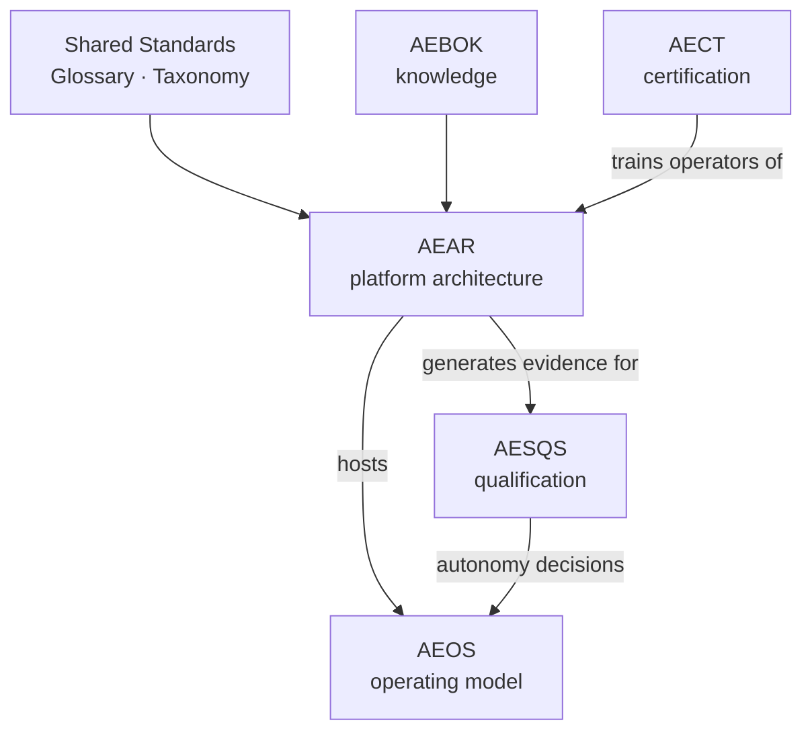

# AEAR — AI Engineering Architecture Reference

| | |
|---|---|
| **Document ID** | AIES-AEAR-00 |
| **Status** | Review |
| **Audience** | All readers |

**The question this module answers: *What should enterprise AI platforms look like?***

The key words "MUST", "MUST NOT", "SHOULD", "SHOULD NOT", and "MAY" in this document are to be interpreted as described in RFC 2119.

---

## 1. Purpose

AEAR defines vendor-neutral **reference architectures** for enterprise AI engineering platforms — the technical systems that host AI participation across the SDLC phases P01–P16 defined in the [Taxonomy (AIES-SHARED-02 — Taxonomy)](../Shared/Taxonomy/README.md).

Organizations adopting AI-native software engineering face the same architectural questions repeatedly:

- How do we route work between humans, agents, and models without vendor lock-in?
- Where are autonomy levels (AL0 — Manual through AL4 — Autonomous) and risk tiers (RT1 — Minimal through RT4 — Critical) actually *enforced* in the stack?
- How do we give agents identity, entitlements, and audit trails equivalent to those we give humans?
- How do we contain what agents can execute, read, and exfiltrate?
- How do we observe, evaluate, and account for AI activity at enterprise scale?

AEAR answers these questions with a **core reference architecture**, guidance for **cross-cutting concerns**, and a catalog of **industry blueprints** showing how the core specializes under different regulatory and operational constraints.

## 2. How to Use Reference Architectures

A reference architecture is a **starting point, not a prescription**.

- [AIES-AEAR-00-R01 — Reference Architecture, requirement 01] Organizations MUST evaluate the reference architecture against their own requirements, constraints, and risk profile before adoption; adopting it unmodified without such an evaluation is non-conformant.
- [AIES-AEAR-00-R02 — Reference Architecture, requirement 02] Deviations from normative requirements in AEAR documents MUST be recorded with rationale (an ADR, artifact ART-04, is the RECOMMENDED form).
- [AIES-AEAR-00-R03 — Reference Architecture, requirement 03] Architectures derived from AEAR MUST remain vendor-neutral at the specification level: components are named by capability (e.g., "model gateway", "vector-capable knowledge store"), and concrete products are bound only at the implementation level, behind replaceable interfaces.

The intended workflow:

```
1. Read the core reference architecture (AIES-AEAR-CORE-01)
2. Select the closest industry blueprint (AIES-AEAR-BP-*)
3. Map your requirements and risk tiers onto the planes
4. Record deltas and deviations as ADRs (ART-04)
5. Self-assess against the capability checklist (AIES-AEAR-CORE-01 §16)
6. Iterate as autonomy levels are raised with evidence (AESQS)
```

## 3. Document Map

| Document ID | Document | Purpose |
|-------------|----------|---------|
| AIES-AEAR-00 | This document | Module overview and reading guide |
| [AIES-AEAR-CORE-01 — Core Reference Architecture](core-reference-architecture.md) | Core Reference Architecture | The layered Enterprise AI Engineering Platform: eight planes, deployment topologies, SDLC integration, capability checklist |
| [AIES-AEAR-XC-01 — Cross-Cutting Concerns](cross-cutting-concerns.md) | Cross-Cutting Concerns | How domains X01–X15 manifest architecturally: security zones, privacy, compliance evidence, cost, reliability, performance |
| [AIES-AEAR-BP-00 — Industry Blueprints](blueprints/README.md) | Blueprint Catalog | What a blueprint contains and how to adapt one |
| [AIES-AEAR-BP-ENTERPRISE — Enterprise Platform Blueprint](blueprints/enterprise-platform.md) | Enterprise Platform Blueprint | The general large-enterprise case (most detailed) |
| [AIES-AEAR-BP-BANKING — Banking Blueprint](blueprints/banking.md) | Banking Blueprint | Financial regulation, transaction criticality, model risk management |
| [AIES-AEAR-BP-HEALTHCARE — Healthcare Blueprint](blueprints/healthcare.md) | Healthcare Blueprint | Patient data, clinical safety, regulated software |
| [AIES-AEAR-BP-ECOMMERCE — Ecommerce Blueprint](blueprints/ecommerce.md) | E-Commerce Blueprint | Consumer scale, payment adjacency, experimentation velocity |
| [AIES-AEAR-BP-MANUFACTURING — Manufacturing Blueprint](blueprints/manufacturing.md) | Manufacturing Blueprint | OT/IT boundary, safety systems |
| [AIES-AEAR-BP-GOVERNMENT — Government Blueprint](blueprints/government.md) | Government Blueprint | Sovereignty, air-gapped operation, procurement |
| [AIES-AEAR-BP-SAAS — SaaS Blueprint](blueprints/saas.md) | SaaS Blueprint | Multi-tenancy, velocity vs. governance |
| [AIES-AEAR-BP-CARLEASING — Car Leasing Blueprint](blueprints/car-leasing.md) | Car Leasing Blueprint | Contract lifecycle, residual value analytics, dealer integrations |
| [AIES-AEAR-BP-OILGAS — Oil and Gas Blueprint](blueprints/oil-gas.md) | Oil & Gas Blueprint | HSE criticality, field operations, legacy SCADA adjacency |

## 4. Relationship to Other Modules

AEAR describes the **platform**; [AEOS](../AEOS/README.md) describes the **operating model** that runs on it. Every AEOS construct has a hosting surface in the AEAR architecture:

| AEOS construct | AEAR hosting surface |
|----------------|----------------------|
| Roles (ROLE-01…ROLE-14) and human-AI pairs | Interaction Plane; agent identities in the Governance Plane |
| Autonomy envelopes and approval gates (X07) | Orchestration Plane enforcement; approval consoles in the Interaction Plane |
| Agent Definitions (ART-14) | Versioned registry in the Governance Plane, executed by the Orchestration Plane |
| Audit trails (ART-15) | Observability and Governance Planes |
| Quality gates | Execution Plane (CI/CD integration) and Guardrail Plane |

Other module relationships:

- **[AEBOK](../AEBOK/README.md)** supplies the knowledge — practices and patterns — that the platform operationalizes; AEAR cites AEBOK rather than restating it.
- **[AESQS](../AESQS/README.md)** produces the qualification evidence (EV1–EV6 scores) that justifies raising autonomy levels; the platform's evaluation pipelines (Observability Plane) generate that evidence.
- **[AECT](../AECT/README.md)** trains and certifies the people who design, operate, and govern platforms conformant with AEAR.
- **[Shared Standards](../Shared/README.md)** provide the glossary, taxonomy, and conventions this module uses throughout. AEAR never redefines shared terms.



## 5. Reading Guide

| If you are a… | Start with |
|---------------|-----------|
| Enterprise / platform architect | [AIES-AEAR-CORE-01 — Core Reference Architecture](core-reference-architecture.md), then [AIES-AEAR-XC-01 — Cross-Cutting Concerns](cross-cutting-concerns.md) |
| Engineering leader evaluating readiness | Capability checklist in [AIES-AEAR-CORE-01 — Core Reference Architecture §16](core-reference-architecture.md#16-capability-checklist) |
| Security or compliance officer | [AIES-AEAR-XC-01 — Cross-Cutting Concerns](cross-cutting-concerns.md), then your industry blueprint |
| Practitioner in a specific industry | [AIES-AEAR-BP-00 — Industry Blueprints](blueprints/README.md) and the matching blueprint |

---

## Related Documents

- [AIES-AEAR-CORE-01 — Core Reference Architecture — Enterprise AI Engineering Platform](core-reference-architecture.md)
- [AIES-AEAR-XC-01 — Cross-Cutting Concerns in Platform Architecture](cross-cutting-concerns.md)
- [AIES-AEAR-BP-00 — AEAR Blueprint Catalog](blueprints/README.md)
- [Taxonomy (AIES-SHARED-02 — Taxonomy)](../Shared/Taxonomy/README.md) · [Glossary (AIES-SHARED-01 — Glossary)](../Shared/Glossary/README.md)

## References

- RFC 2119 — Key words for use in RFCs to Indicate Requirement Levels
- RFC 8174 — Ambiguity of Uppercase vs Lowercase in RFC 2119 Key Words
