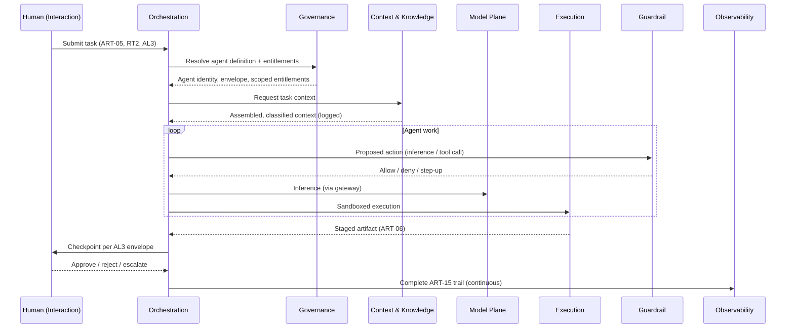

# Core Reference Architecture — Enterprise AI Engineering Platform

| | |
|---|---|
| **Document ID** | AIES-AEAR-CORE-01 |
| **Status** | Review |
| **Audience** | Architects · Platform teams |

The vendor-neutral reference architecture for an **Enterprise AI Engineering Platform**: the system of systems through which AI agents and human engineers jointly deliver software across SDLC phases P01–P16.

The key words "MUST", "MUST NOT", "SHOULD", "SHOULD NOT", and "MAY" in this document are to be interpreted as described in RFC 2119.

Terminology follows the [Glossary (AIES-SHARED-01)](../Shared/Glossary/README.md); classification scales follow the [Taxonomy (AIES-SHARED-02)](../Shared/Taxonomy/README.md).

---

## 1. Scope and Audience

This document defines **what capabilities an enterprise AI engineering platform must provide and how they are structured** — not which products provide them. It is written for enterprise architects, platform engineering teams, and the security, compliance, and governance functions that must approve such platforms.

The architecture assumes the operating model defined by [AEOS](../AEOS/README.md): work flows through roles (ROLE-01…ROLE-14), every AI-performed task carries a declared autonomy level (AL0–AL4) derived from its risk tier (RT1–RT4), and humans retain authority at defined gates. The platform is the machinery that makes that operating model enforceable rather than aspirational.

Out of scope: model training infrastructure, data science experimentation platforms, and end-user AI product features. Where those systems exist, they integrate with this architecture as adjacent systems.

## 2. Architectural Principles

| # | Principle | Consequence |
|---|-----------|-------------|
| 1 | **Vendor neutrality by construction** | Every externally sourced capability (models, knowledge stores, execution infrastructure) sits behind a platform-owned interface and is replaceable without changing the planes that consume it |
| 2 | **Policy enforced outside the model** | Guardrails, autonomy envelopes, and entitlements are enforced by deterministic platform components; model behavior is never the control (see Glossary: *Guardrail*) |
| 3 | **Agents are first-class principals** | Agents receive identity, entitlements, and audit obligations equivalent in rigor to those of human engineers |
| 4 | **Least authority per task** | Access is granted per task, scoped to the task's declared autonomy level and risk tier, and revoked at task completion |
| 5 | **Everything observable, everything attributable** | Every significant action produces an audit trail record (ART-15) with provenance |
| 6 | **Degrade toward human control** | On failure or uncertainty, the platform reduces autonomy (AL(n) → AL(n−1) → … → AL0), never increases it |
| 7 | **Evidence before authority** | Autonomy level increases require qualification evidence per [AESQS](../AESQS/README.md) ([AIES-SHARED-02-R03]) |

## 3. The Layered Plane Model

The platform is organized into **eight planes**. A plane is a cohesive set of responsibilities with defined interfaces — planes are logical layers that may be realized by one or many deployed services.

```
                        HUMANS (engineers, reviewers, approvers, auditors)
                                            │
┌───────────────────────────────────────────▼────────────────────────────────────────┐
│  1. INTERACTION PLANE                                                              │
│     IDEs · chat surfaces · review UIs · approval consoles · dashboards             │
└───────────────────────────────────────────┬────────────────────────────────────────┘
                                            │ tasks, reviews, approvals
┌───────────────────────────────────────────▼────────────────────────────────────────┐
│  2. ORCHESTRATION PLANE                                                            │
│     agent runtime · task routing · workflow engine · autonomy envelope enforcement │
│     escalation manager · agent-to-agent coordination                               │
└──────┬─────────────────────┬──────────────────────────────┬────────────────────────┘
       │ inference           │ context                      │ actions
┌──────▼──────────┐  ┌───────▼───────────────────┐  ┌───────▼────────────────────────┐
│  3. MODEL       │  │  4. CONTEXT & KNOWLEDGE   │  │  5. EXECUTION PLANE            │
│     PLANE       │  │     PLANE                 │  │     sandboxed tool execution   │
│  model gateway: │  │  knowledge stores         │  │     code environments          │
│  routing        │  │  context assembly         │  │     CI/CD integration          │
│  failover       │  │  retrieval services       │  │     artifact staging           │
│  versioning     │  │  context asset mgmt       │  │                                │
│  cost controls  │  │  (ART-13)                 │  │                                │
└──────┬──────────┘  └───────┬───────────────────┘  └───────┬────────────────────────┘
       │                     │                              │
┌──────▼─────────────────────▼──────────────────────────────▼────────────────────────┐
│  6. GUARDRAIL PLANE  (interposed on every cross-plane call)                        │
│     policy enforcement points · action filtering · secrets isolation ·             │
│     egress control · content boundaries                                            │
└───────────────────────────────────────────┬────────────────────────────────────────┘
                                            │ telemetry, events, evidence
┌───────────────────────────────────────────▼────────────────────────────────────────┐
│  7. OBSERVABILITY PLANE                                                            │
│     telemetry pipeline · agent activity logs (ART-15) · evaluation pipelines ·     │
│     metrics, traces, alerting                                                      │
└───────────────────────────────────────────┬────────────────────────────────────────┘
                                            │ identity, policy, audit
┌───────────────────────────────────────────▼────────────────────────────────────────┐
│  8. GOVERNANCE PLANE  (spans all planes)                                           │
│     identity for humans AND agents · entitlements bound to autonomy levels ·       │
│     agent definition registry (ART-14) · audit store · compliance reporting        │
└─────────────────────────────────────────────────────────────────────────────────────┘
```

Reading the diagram:

- The **Guardrail Plane** is not a layer traffic passes through once; it is **interposed on every cross-plane call** (orchestration→model, orchestration→execution, context→external source, execution→network).
- The **Governance Plane** underlies everything: no plane accepts a request without a principal identity and entitlement decision it issued.
- The **Observability Plane** receives events from all planes; nothing significant happens unobserved.

[AIES-AEAR-CORE-01-R01] A conformant platform MUST provide the responsibilities of all eight planes. Planes MAY be realized by shared infrastructure, but their interfaces and policy boundaries MUST remain distinguishable.

[AIES-AEAR-CORE-01-R02] All inter-plane communication MUST occur over defined, versioned interfaces; no plane may bypass the Guardrail Plane's enforcement points or the Governance Plane's identity checks.

---

## 4. Interaction Plane

Where humans meet the platform. Every human role in the Taxonomy — from ROLE-06 Software Engineer to ROLE-13 Human Approver and ROLE-14 Governance Officer — works through this plane.

**Responsibilities**

- Present AI assistance inside the tools engineers already use (IDEs, terminals, chat surfaces).
- Surface AI-produced artifacts for structured human review at the fidelity the risk tier demands.
- Provide **approval consoles**: dedicated surfaces where ROLE-13 approvers see pending gates, the evidence behind each request, and the exact scope being authorized.
- Provide oversight dashboards for supervisors (AL3 checkpoint review, AL4 sampling and audit).

**Key components**

| Component | Capability description |
|-----------|------------------------|
| IDE / editor integrations | In-context suggestion, generation, and review surfaces bound to the engineer's identity |
| Chat / conversational surfaces | Task initiation and iterative collaboration with agents |
| Review UI | Diff-oriented review of AI-produced changes (ART-06) with provenance displayed |
| Approval console | Gate queue for ROLE-13 with evidence bundle, scope statement, and one-action approve/reject/escalate |
| Oversight dashboard | Live and historical view of agent activity, autonomy levels in force, and sampling queues |

**Normative requirements**

- [AIES-AEAR-CORE-01-R03] Every surface in the Interaction Plane MUST display the provenance of AI-produced content (producing agent, autonomy level, model version identifier) wherever that content is presented for human decision.
- [AIES-AEAR-CORE-01-R04] Approval actions MUST be attributable to an authenticated human principal and MUST NOT be automatable, scriptable, or delegable to an agent (see [AIES-SHARED-02 §5]: ROLE-13 is human-only).
- [AIES-AEAR-CORE-01-R05] The approval console MUST present the full scope of what is being approved (files, systems, actions, autonomy envelope) before authorization; blanket or blind approvals MUST NOT be offered as a default interaction.
- [AIES-AEAR-CORE-01-R06] Interaction surfaces SHOULD make rejection and escalation as low-friction as approval, to avoid approval-fatigue bias.

**Interfaces**: submits tasks to and receives results from the **Orchestration Plane**; authenticates every session via the **Governance Plane**; renders evidence sourced from the **Observability Plane**.

## 5. Orchestration Plane

The platform's brain: it turns intents into governed agent work.

**Responsibilities**

- Host the **agent runtime**: instantiate agents from versioned Agent Definitions (ART-14), manage their lifecycle, and terminate them deterministically.
- **Task routing**: match incoming work items (ART-05) to agents or human-AI pairs based on task type, declared risk tier, and available qualifications.
- Run the **workflow engine**: multi-step engineering workflows with human gates positioned per risk tier.
- **Autonomy envelope enforcement**: constrain each running agent to the actions, resources, and decisions its envelope permits; trigger escalation when the envelope is exceeded.
- Manage agent-to-agent delegation and coordination without authority amplification.

**Key components**

| Component | Capability description |
|-----------|------------------------|
| Agent runtime | Executes agents defined by ART-14; enforces lifecycle (instantiate → execute → checkpoint → terminate) |
| Task router | Assigns tasks using risk tier, autonomy level, and qualification records |
| Workflow engine | Declarative multi-step flows with embedded quality gates and approval gates |
| Envelope enforcer | Deterministic pre-action check of every agent action against the declared envelope |
| Escalation manager | Routes envelope breaches, low-confidence states, and gate timeouts to humans per X07 policy |

**Normative requirements**

- [AIES-AEAR-CORE-01-R07] Every task executed by the Orchestration Plane MUST carry a declared risk tier and autonomy level before execution begins ([AIES-SHARED-02-R01]).
- [AIES-AEAR-CORE-01-R08] The autonomy envelope MUST be enforced by the Orchestration Plane as a deterministic check on every agent action; the agent's own reasoning MUST NOT be the enforcement mechanism.
- [AIES-AEAR-CORE-01-R09] Agents MUST only be instantiated from versioned, approved Agent Definitions (ART-14) resolved from the Governance Plane registry.
- [AIES-AEAR-CORE-01-R10] When an agent delegates to another agent, the delegate's effective authority MUST be the intersection of both envelopes; delegation MUST NOT amplify authority.
- [AIES-AEAR-CORE-01-R11] Envelope breaches MUST halt the offending action, produce an ART-15 record, and escalate per the agent's escalation rules; the platform MUST NOT silently retry a blocked action.
- [AIES-AEAR-CORE-01-R12] Workflow definitions SHOULD be declarative, versioned artifacts subject to the same review controls as source changes.

**Interfaces**: receives tasks and returns results via the **Interaction Plane**; requests inference from the **Model Plane**; requests assembled context from the **Context & Knowledge Plane**; dispatches actions to the **Execution Plane** — all through **Guardrail Plane** enforcement points; resolves identities, definitions, and entitlements from the **Governance Plane**; emits full activity telemetry to the **Observability Plane**.

## 6. Model Plane

All model inference flows through a single logical choke point: the **model gateway**. No component of the platform calls a model provider directly.

**Responsibilities**

- **Routing**: select among multiple interchangeable model providers/deployments by task profile (capability class, latency class, cost class, data-residency class).
- **Failover**: detect provider degradation and re-route or queue per policy.
- **Versioning**: pin, record, and control the model version used for every request; manage staged rollout of model changes.
- **Cost controls**: meter every request, attribute cost to task/team/tenant, and enforce budgets and quotas (X10).
- Normalize provider-specific APIs behind one platform contract.

**Key components**

| Component | Capability description |
|-----------|------------------------|
| Model gateway | Single ingress for all inference; policy-driven routing, retries, failover |
| Provider adapters | Per-provider translation to the platform's normalized inference contract |
| Model registry | Catalog of approved models/versions with capability class, evaluation status, and data-handling class |
| Usage metering | Per-request token/latency/cost accounting attributed to principal, task, and tenant |
| Rollout controller | Canary and staged promotion of model version changes, with automated evaluation gates |

**Normative requirements**

- [AIES-AEAR-CORE-01-R13] All model inference MUST traverse the model gateway; direct provider access from any other plane MUST be technically prevented (egress control, see [AIES-AEAR-XC-01](cross-cutting-concerns.md)).
- [AIES-AEAR-CORE-01-R14] The platform MUST support at least two interchangeable providers (or deployments) for each critical capability class, and failover between them MUST be exercised (tested), not merely configured.
- [AIES-AEAR-CORE-01-R15] Every inference request and response MUST be attributable to a model identifier and version, recorded in the corresponding ART-15 audit record.
- [AIES-AEAR-CORE-01-R16] Model version changes MUST pass the platform's evaluation pipeline (Observability Plane) before serving tasks at RT2 or above; organizations SHOULD gate all tiers.
- [AIES-AEAR-CORE-01-R17] The gateway MUST enforce budget and quota policy at request time; exhausted budgets MUST fail closed with escalation, not degrade into unmetered usage.
- [AIES-AEAR-CORE-01-R18] The gateway SHOULD support routing by data-handling class so that requests carrying regulated data reach only providers/deployments approved for that class.

**Interfaces**: serves the **Orchestration Plane** (and, where permitted, the Context & Knowledge Plane for embedding/enrichment inference); enforces **Guardrail Plane** content policies on prompts and completions; reports usage to the **Observability Plane**; takes provider approval status and budget policy from the **Governance Plane**.

## 7. Context & Knowledge Plane

What the organization knows, made safely available to agents. Quality of context determines quality of AI output; leakage of context is the platform's largest confidentiality exposure.

**Responsibilities**

- Maintain **knowledge stores**: code and repository knowledge, standards and conventions, architectural decisions (ART-04), operational knowledge (ART-11), and organizational documentation — including vector-capable stores for semantic retrieval.
- **Context assembly**: compose the task-scoped context window from retrieved knowledge, task inputs, and curated context assets, within token and relevance budgets.
- **Retrieval**: semantic and structural search over knowledge stores with entitlement-aware filtering.
- **Context asset management (ART-13)**: version, review, approve, and distribute prompts, instructions, and curated context as first-class engineering artifacts.

**Key components**

| Component | Capability description |
|-----------|------------------------|
| Knowledge stores | Structured, document, and vector-capable stores for organizational knowledge |
| Ingestion & indexing pipeline | Controlled ingestion with classification tagging, PII handling, and freshness tracking |
| Retrieval service | Entitlement-filtered semantic/structural retrieval |
| Context assembler | Deterministic, logged composition of per-task context |
| Context asset registry | Versioned ART-13 store with review workflow and provenance |

**Normative requirements**

- [AIES-AEAR-CORE-01-R19] Retrieval MUST be entitlement-aware: an agent MUST NOT retrieve content its acting principal (or the human it acts for) is not entitled to read.
- [AIES-AEAR-CORE-01-R20] Every item ingested into a knowledge store MUST carry a data classification, and classification MUST propagate through retrieval into context assembly so downstream planes can enforce data-handling policy.
- [AIES-AEAR-CORE-01-R21] Context assets (ART-13) MUST be versioned and MUST pass a review workflow proportionate to the risk tier of the tasks they serve before production use.
- [AIES-AEAR-CORE-01-R22] The context assembled for each task MUST be recorded (or deterministically reconstructible) to satisfy provenance and traceability obligations.
- [AIES-AEAR-CORE-01-R23] Knowledge stores SHOULD track freshness and source provenance, and the context assembler SHOULD prefer authoritative, current sources over stale or derived ones.

**Interfaces**: serves assembled context to the **Orchestration Plane**; may use the **Model Plane** for embedding and enrichment; all external-source ingestion passes **Guardrail Plane** ingress controls; classification and entitlement policy come from the **Governance Plane**; retrieval and assembly events flow to the **Observability Plane**.

## 8. Execution Plane

Where agent intentions become real actions — and therefore where containment matters most.

**Responsibilities**

- Provide **sandboxed tool execution**: every tool an agent invokes runs in a contained environment with explicit resource, filesystem, and network scoping.
- Provide **code environments**: ephemeral, reproducible workspaces where agents build, run, and test code.
- **CI/CD integration**: agents participate in existing pipelines (ART-09) through the same interfaces as humans — opening changes (ART-06), triggering builds, reading results — never bypassing pipeline gates.
- Stage artifacts produced by agents for downstream quality gates.

**Key components**

| Component | Capability description |
|-----------|------------------------|
| Tool sandbox | Isolated execution of tool calls with per-task capability grants |
| Ephemeral code environments | Disposable, reproducible workspaces provisioned per task, destroyed at completion |
| Toolchain connectors | Governed adapters to version control, work tracking, build, and deployment systems |
| Artifact staging | Quarantine area where agent outputs await quality/approval gates |

**Normative requirements**

- [AIES-AEAR-CORE-01-R24] All agent-initiated tool execution MUST occur in sandboxed environments with explicitly granted capabilities; default capability MUST be none.
- [AIES-AEAR-CORE-01-R25] Code environments MUST be ephemeral and reproducible; state MUST NOT persist between tasks except through governed artifact channels (version control, artifact staging).
- [AIES-AEAR-CORE-01-R26] Agents MUST reach production-affecting systems only through existing CI/CD pipelines and their quality gates; the Execution Plane MUST NOT offer agents a direct path to production.
- [AIES-AEAR-CORE-01-R27] Sandbox network access MUST be default-deny, with per-task allowlists enforced by the Guardrail Plane's egress control.
- [AIES-AEAR-CORE-01-R28] Execution environments MUST NOT contain long-lived credentials; secrets are brokered per §9.
- [AIES-AEAR-CORE-01-R29] Irreversible actions (data deletion, external communications, financial operations) MUST be classified RT4 by default and thus gated at AL1 unless a documented risk acceptance says otherwise ([AIES-SHARED-02 §4]).

**Interfaces**: receives action requests from the **Orchestration Plane** through **Guardrail Plane** filters; integrates with external SDLC toolchains (§14); emits execution telemetry to the **Observability Plane**; sandbox capability grants derive from **Governance Plane** entitlements.

## 9. Guardrail Plane

Deterministic controls that hold **regardless of what any model says or any prompt contains**. Guardrails are enforced outside the model (Glossary: *Guardrail*).

**Responsibilities**

- **Policy enforcement points (PEPs)** interposed on every cross-plane call, evaluating policy-as-code against the acting principal, task, risk tier, and data classification.
- **Action filtering**: block or require step-up approval for action classes (destructive operations, external side effects, entitlement changes) independent of agent instructions.
- **Secrets isolation**: broker short-lived, scoped credentials to execution environments; keep secret material out of prompts, context, logs, and model traffic.
- **Egress control**: default-deny network egress from agent-reachable components; allowlisted destinations only; inspection of what leaves the platform boundary.
- Content boundaries on model traffic: prompt-injection surface reduction on ingress, sensitive-data detection on ingress and egress.

**Key components**

| Component | Capability description |
|-----------|------------------------|
| Policy engine + PEPs | Central policy-as-code decisions, enforced at distributed enforcement points |
| Action filter | Class-based allow/deny/step-up decisions on agent actions |
| Secrets broker | Just-in-time issuance of short-lived scoped credentials; automatic revocation |
| Egress gateway | Default-deny network boundary with allowlists and data-loss inspection |
| Content inspection | Classification-aware scanning of context, prompts, and outputs |

**Normative requirements**

- [AIES-AEAR-CORE-01-R30] Guardrails MUST be enforced by deterministic components outside the model; a model's refusal behavior MUST NOT be counted as a control.
- [AIES-AEAR-CORE-01-R31] Guardrail policy MUST be expressed as versioned policy-as-code, reviewed and released through the same change controls as production software.
- [AIES-AEAR-CORE-01-R32] Guardrail decisions MUST fail closed: on policy-engine unavailability, the affected action classes MUST be denied and escalated.
- [AIES-AEAR-CORE-01-R33] Secret material MUST NOT appear in prompts, assembled context, model traffic, or logs; the secrets broker MUST issue only short-lived, task-scoped credentials.
- [AIES-AEAR-CORE-01-R34] Every guardrail denial MUST produce an ART-15 record including the policy that fired; denials MUST be visible to supervision surfaces in the Interaction Plane.
- [AIES-AEAR-CORE-01-R35] Guardrail bypass paths (break-glass) MUST require human authorization by ROLE-13 or ROLE-14, MUST be time-bound, and MUST be conspicuously audited.

**Interfaces**: interposed on **Orchestration→Model**, **Orchestration→Execution**, **Context ingestion**, and **all egress**; policy content and principal attributes come from the **Governance Plane**; all decisions stream to the **Observability Plane**.

## 10. Observability Plane

If the Governance Plane is the platform's law, this plane is its memory and its instruments.

**Responsibilities**

- Collect **telemetry** — metrics, traces, structured events — from every plane, correlated end-to-end per task.
- Maintain **agent activity logs**: the complete, immutable record of agent actions constituting the audit trail (ART-15) — actor, inputs, context reference, model version, actions, outputs, approvals.
- Run **evaluation pipelines**: scheduled and event-driven evaluation of agent and model output quality along EV1–EV6, producing the evidence (ART-12) that AESQS qualification and autonomy-level decisions consume.
- Detect anomalies in agent behavior (volume, scope, error, cost) and alert supervision.

**Key components**

| Component | Capability description |
|-----------|------------------------|
| Telemetry pipeline | Ingestion, correlation, and retention of cross-plane events keyed by task and principal |
| Agent activity log store | Append-only, tamper-evident ART-15 store with query interfaces for audit |
| Evaluation pipeline | Automated scoring of outputs along EV1–EV6; regression detection across model/agent versions |
| Anomaly detection & alerting | Behavioral baselining of agents; alerts routed to oversight dashboards |
| Evidence service | Assembles evaluation and activity evidence into consumable bundles for gates, audits, and AESQS |

**Normative requirements**

- [AIES-AEAR-CORE-01-R36] Every significant agent action MUST produce an ART-15 record capturing actor, task, autonomy level, inputs (or references), model version, actions taken, and outputs; records MUST be tamper-evident and retained per compliance policy.
- [AIES-AEAR-CORE-01-R37] Telemetry MUST be correlatable end-to-end: a single task identifier MUST link interaction, orchestration, inference, context, execution, and guardrail events.
- [AIES-AEAR-CORE-01-R38] The platform MUST operate evaluation pipelines whose outputs (ART-12) are the evidentiary basis for autonomy-level changes; autonomy MUST NOT be raised without such evidence ([AIES-SHARED-02-R03]).
- [AIES-AEAR-CORE-01-R39] Evaluation MUST run continuously in production (sampling live outputs), not only pre-release.
- [AIES-AEAR-CORE-01-R40] Observability data access MUST itself be entitlement-controlled and audited, since activity logs and captured context may contain sensitive material.
- [AIES-AEAR-CORE-01-R41] Anomalous agent behavior SHOULD trigger automatic autonomy reduction for the affected agent pending human review (principle 6, §2).

**Interfaces**: receives events from **all planes**; feeds evidence to the **Interaction Plane** (dashboards, approval consoles), the **Governance Plane** (compliance reporting), and **AESQS** processes; entitlements from the **Governance Plane**.

## 11. Governance Plane

The root of authority. Everything else enforces; this plane decides who and what may act, with how much authority, and proves it afterwards.

**Responsibilities**

- **Identity for humans AND agents**: every principal — human engineer or AI agent instance — has a unique, verifiable identity. Agent identities are distinct from, but linked to, the humans and Agent Definitions they act under.
- **Entitlements bound to autonomy levels**: what a principal may do is a function of role, qualification, task risk tier, and — for agents — the declared autonomy level of the current task.
- Operate the **Agent Definition registry** (ART-14): the versioned, approved catalog from which all agents are instantiated.
- Maintain the **audit store** of record and produce **compliance reporting** mapped to the regulatory obligations in force.
- Administer policy lifecycle: authoring, review, approval, and distribution of the policies the Guardrail Plane enforces.

**Key components**

| Component | Capability description |
|-----------|------------------------|
| Identity provider (human + agent) | Authentication and identity lifecycle for all principals; agent identities issued per instantiation, linked to ART-14 version and accountable human owner |
| Entitlement service | Policy-based authorization; entitlements computed per task from role × qualification × risk tier × autonomy level |
| Agent Definition registry | Versioned ART-14 store with approval workflow and deprecation |
| Audit store | System of record for ART-15; legal-hold and retention management |
| Compliance reporting | Mappings from platform evidence to external obligations; report generation for auditors |
| Policy administration | Lifecycle management of guardrail and governance policy-as-code |

**Normative requirements**

- [AIES-AEAR-CORE-01-R42] Every agent instance MUST hold a unique identity distinct from any human identity, linked to its Agent Definition version (ART-14) and to an accountable human owner.
- [AIES-AEAR-CORE-01-R43] Agents MUST NOT authenticate using human credentials, and humans MUST NOT act under agent identities; shared or ambient credentials MUST NOT exist on the platform.
- [AIES-AEAR-CORE-01-R44] Entitlements granted to an agent for a task MUST be derived from, and MUST NOT exceed, the task's declared autonomy level and risk tier; entitlements MUST expire at task completion.
- [AIES-AEAR-CORE-01-R45] Changes to Agent Definitions, entitlement policy, or guardrail policy MUST themselves be treated as RT3-or-higher changes with corresponding human review.
- [AIES-AEAR-CORE-01-R46] The Governance Plane MUST be able to demonstrate, for any past action, the full authorization chain: which principal, under which definition and version, with which entitlements, approved by whom.
- [AIES-AEAR-CORE-01-R47] Compliance reporting SHOULD be generated from platform evidence automatically rather than assembled manually (see [AIES-AEAR-XC-01 §4](cross-cutting-concerns.md#4-compliance-evidence-generation-x03)).

**Interfaces**: authenticates and authorizes **every plane**; supplies Agent Definitions to the **Orchestration Plane**, policy to the **Guardrail Plane**, and classification/entitlement schemes to the **Context & Knowledge Plane**; consumes evidence from the **Observability Plane**.

---

## 12. Cross-Plane Flows (Illustrative)

A representative AL3 (Delegated) engineering task at RT2:



## 13. Deployment Topologies

The plane model is topology-independent. Three canonical topologies, plus the hybrid combinations most real estates run:

### 13.1 Single-Tenant

All planes deployed within one organization's security boundary; model providers may be external (reached only through the model gateway and egress controls) or internally hosted.

- Simplest entitlement and data-residency story; the default for organizations with strong sovereignty or confidentiality needs.
- [AIES-AEAR-CORE-01-R48] Even in single-tenant deployments, internal segmentation between planes (especially Execution and Guardrail) MUST be preserved; single tenancy is not a substitute for containment.

### 13.2 Multi-Tenant

One platform instance serves multiple organizational tenants (business units, subsidiaries, or — for platform vendors — customers).

- [AIES-AEAR-CORE-01-R49] Multi-tenant deployments MUST isolate per tenant: knowledge stores and context, agent identities and entitlements, audit trails, cost accounting, and guardrail policy. Cross-tenant retrieval or delegation MUST be impossible by default.
- [AIES-AEAR-CORE-01-R50] Tenant-level noisy-neighbor protection (quotas on inference, execution, and retrieval) MUST be enforced in the Model and Execution Planes.
- Evaluation baselines and anomaly models SHOULD be per-tenant, since behavior norms differ.

### 13.3 Air-Gapped

No egress to external networks; all model serving, knowledge storage, and toolchains are inside the boundary.

- The Model Plane fronts internally hosted model deployments only; the gateway's routing/failover/versioning duties are unchanged.
- [AIES-AEAR-CORE-01-R51] Air-gapped deployments MUST replace external-provider failover with redundancy across internal model deployments and MUST define degraded-mode operation (reduced autonomy, queueing) for model unavailability.
- Model, knowledge, and policy updates arrive through controlled transfer processes; the update channel MUST be treated as a supply-chain risk surface (see [AIES-AEAR-XC-01](cross-cutting-concerns.md)).
- The [Government blueprint](blueprints/government.md) details this topology.

### 13.4 Hybrid

Most real estates mix the above (e.g., single-tenant control planes with externally served models for RT1–RT2 work and internally served models for RT3–RT4 data classes). The model gateway's data-handling-class routing ([AIES-AEAR-CORE-01-R18]) is the mechanism that makes hybrid safe.

## 14. Integration with Existing SDLC Toolchains

The platform augments — never replaces — the organization's existing engineering systems.

| Existing system | Integration point | Rule of engagement |
|-----------------|-------------------|--------------------|
| Version control | Execution Plane toolchain connector | Agents author changes (ART-06) under their own identity; merges pass existing review + quality gates |
| Work tracking | Orchestration Plane task router | Tasks (ART-05) originate in, and report status to, the existing tracker |
| CI/CD | Execution Plane | Agents trigger and consume pipelines (ART-09); they MUST NOT bypass pipeline gates ([AIES-AEAR-CORE-01-R26]) |
| Code review tooling | Interaction Plane review UI | AI-authored changes enter the same review flow with provenance labels ([AIES-AEAR-CORE-01-R03]) |
| Artifact/package registries | Execution Plane | Agent-published artifacts pass the same signing and scanning gates |
| Enterprise identity provider | Governance Plane | Human identities federate; agent identities extend (not fork) the enterprise identity model |
| Enterprise observability | Observability Plane | Platform telemetry exports to enterprise systems; ART-15 remains the system of record |

[AIES-AEAR-CORE-01-R52] Agent actions in external toolchains MUST be performed under the agent's own identity (service principal), never under a shared or human account, so that toolchain-native audit logs remain attributable.

[AIES-AEAR-CORE-01-R53] The platform SHOULD integrate through the toolchains' standard extension interfaces rather than screen-level or credential-sharing mechanisms, so integrations survive toolchain upgrades and remain auditable.

## 15. Non-Functional Requirements

Aligned to cross-cutting domains X10–X13; architectural treatment in [AIES-AEAR-XC-01](cross-cutting-concerns.md).

### 15.1 Cost (X10)

- [AIES-AEAR-CORE-01-R54] Every unit of AI spend (inference tokens, execution compute, storage) MUST be attributable to a principal, task, and cost center at the time it is incurred.
- [AIES-AEAR-CORE-01-R55] Budgets and quotas MUST be enforceable at request time (fail-closed), not only reported retrospectively.

### 15.2 Performance (X11)

- [AIES-AEAR-CORE-01-R56] The platform MUST define latency classes for interactive assistance versus batch/delegated work, and the model gateway MUST route accordingly.
- Guardrail and entitlement checks sit on the hot path; their decision latency SHOULD be budgeted explicitly (they are part of the product's responsiveness, not overhead to be disabled).

### 15.3 Scalability (X12)

- [AIES-AEAR-CORE-01-R57] Orchestration and Execution Planes MUST scale horizontally with task volume; agent concurrency limits MUST be policy-controlled per team/tenant, not emergent from infrastructure limits.
- Knowledge stores and telemetry retention are the dominant storage growth surfaces and SHOULD have lifecycle policies from day one.

### 15.4 Reliability (X13)

- [AIES-AEAR-CORE-01-R58] The platform MUST define and test degraded modes: model provider loss (gateway failover), evaluation pipeline loss (autonomy freezes at current level; increases blocked), guardrail policy engine loss (fail closed per [AIES-AEAR-CORE-01-R32]), and observability loss (agent execution at AL3–AL4 halts, since unobserved autonomy violates X07).
- [AIES-AEAR-CORE-01-R59] Degradation MUST move autonomy downward, never upward: loss of a control results in more human involvement, not silent continuation.

## 16. Capability Checklist

A self-assessment instrument. Each item maps to normative requirements above; "Yes, evidenced" means the organization can point to the implementing mechanism **and** to evidence it operates.

| # | Capability question | Plane | Refs |
|---|---------------------|-------|------|
| 1 | Is provenance of AI-produced content visible at every human decision point? | Interaction | R03 |
| 2 | Are approvals human-only, scoped, attributable, and non-scriptable? | Interaction | R04, R05 |
| 3 | Does every AI task carry a declared risk tier and autonomy level before execution? | Orchestration | R07 |
| 4 | Are autonomy envelopes enforced deterministically, outside the model? | Orchestration | R08, R30 |
| 5 | Are agents instantiated only from versioned, approved Agent Definitions? | Orchestration / Governance | R09, R42 |
| 6 | Does agent-to-agent delegation intersect (never amplify) authority? | Orchestration | R10 |
| 7 | Does all inference pass through a model gateway, with direct provider access blocked? | Model | R13 |
| 8 | Can you fail over between at least two providers per critical capability class — and have you tested it? | Model | R14 |
| 9 | Is every inference attributable to a model version in the audit trail? | Model | R15 |
| 10 | Are model version changes evaluation-gated before serving RT2+ work? | Model / Observability | R16 |
| 11 | Are budgets/quotas enforced at request time, fail-closed? | Model | R17, R55 |
| 12 | Is retrieval entitlement-aware and classification-propagating? | Context & Knowledge | R19, R20 |
| 13 | Are context assets (ART-13) versioned and review-gated? | Context & Knowledge | R21 |
| 14 | Is per-task assembled context recorded or reconstructible? | Context & Knowledge | R22 |
| 15 | Does all agent tool execution run sandboxed, default-deny, ephemeral? | Execution | R24, R25, R27 |
| 16 | Do agents reach production only through existing CI/CD gates? | Execution | R26 |
| 17 | Are secrets brokered short-lived and absent from prompts, context, and logs? | Guardrail | R28, R33 |
| 18 | Is guardrail policy versioned policy-as-code, failing closed, with audited break-glass? | Guardrail | R31, R32, R35 |
| 19 | Is there a complete, tamper-evident ART-15 trail correlated end-to-end per task? | Observability | R36, R37 |
| 20 | Do evaluation pipelines run continuously and gate autonomy increases? | Observability | R38, R39 |
| 21 | Does anomalous agent behavior reduce autonomy automatically pending review? | Observability | R41 |
| 22 | Do agents hold distinct identities linked to definitions and accountable owners, with no shared credentials? | Governance | R42, R43 |
| 23 | Are agent entitlements derived from autonomy level × risk tier and expired at task end? | Governance | R44 |
| 24 | Can you reproduce the full authorization chain for any past action? | Governance | R46 |
| 25 | Are toolchain actions performed under agent-owned identities? | Execution / Governance | R52 |
| 26 | Are degraded modes defined, tested, and autonomy-reducing? | All | R58, R59 |

Scoring guidance: organizations SHOULD treat items 3, 4, 17, 19, 22, and 26 as gating for any AL3+ operation; the remainder sequence naturally with autonomy ambitions. AESQS provides the formal capability-scoring method.

---

## Related Documents

- [AIES-AEAR-00 — Module Overview](README.md)
- [AIES-AEAR-XC-01 — Cross-Cutting Concerns](cross-cutting-concerns.md)
- [AIES-AEAR-BP-00 — Blueprint Catalog](blueprints/README.md)
- [Taxonomy (AIES-SHARED-02)](../Shared/Taxonomy/README.md) · [Glossary (AIES-SHARED-01)](../Shared/Glossary/README.md)

## References

- RFC 2119 — Key words for use in RFCs to Indicate Requirement Levels
- RFC 8174 — Ambiguity of Uppercase vs Lowercase in RFC 2119 Key Words
