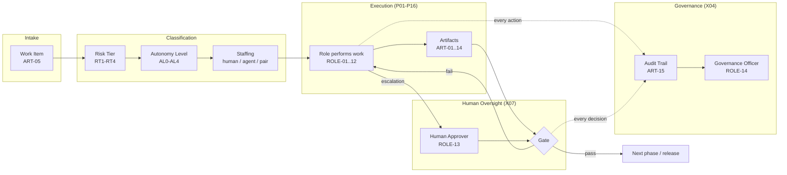

# AEOS — AI Engineering Operating System

| | |
|---|---|
| **Document ID** | AIES-AEOS-00 |
| **Status** | Review |
| **Audience** | All readers |

The key words "MUST", "MUST NOT", "SHOULD", "SHOULD NOT", and "MAY" in this document are to be interpreted as described in RFC 2119.

---

## 1. Purpose

AEOS answers the third AIES question: **How should AI Engineering teams operate?**

Where [AEBOK](../AEBOK/README.md) defines what AI Engineering should *know* and [AESQS](../AESQS/README.md) defines how capability is *evaluated*, AEOS defines how work actually *flows*: through named roles (ROLE-01 … ROLE-14), across the SDLC phases (P01–P16), under declared autonomy levels (AL0–AL4) bounded by risk tiers (RT1–RT4), past human oversight gates, producing canonical artifacts (ART-01 … ART-15) with full audit trails.

The defining property of the AEOS operating model is **role-staffing independence**: every role can be staffed by a human, an AI agent, or a human-AI pair — the responsibilities, gates, and artifact obligations of the role do not change with the staffing choice. The two exceptions are ROLE-13 (Human Approver) and ROLE-14 (Governance Officer), which MUST be staffed by humans per the [Taxonomy (AIES-SHARED-02)](../Shared/Taxonomy/README.md).

## 2. Operating Model at a Glance



Every unit of work is (1) intaken as a work item, (2) classified by risk tier, which caps the autonomy level, (3) assigned to a role staffed according to available qualifications, (4) executed producing artifacts, (5) gated by human oversight proportionate to autonomy, and (6) recorded end-to-end in the audit trail.

## 3. Document Map

| Document | ID | Contents |
|----------|----|----------|
| This document | AIES-AEOS-00 | Module overview and navigation |
| [Operating Model](operating-model.md) | AIES-AEOS-OM-01 | Principles, work intake and flow, staffing decisions, autonomy assignment, provenance, escalation |
| [Role Catalog](roles/README.md) | AIES-AEOS-ROLE-00 | Index of all fourteen roles and shared role-specification requirements |
| [Role Specifications](roles/README.md#2-role-catalog) | AIES-AEOS-ROLE-01 … 14 | One specification per role, ROLE-01 Planner through ROLE-14 Governance Officer |
| [Workflows](workflows.md) | AIES-AEOS-WF-01 | Standard collaboration workflows: feature delivery, defect fix, architecture change, incident response, knowledge update, autonomy promotion |
| [Human Oversight](human-oversight.md) | AIES-AEOS-HO-01 | Gate taxonomy, gate design, approver workload, override and kill-switch, accountability |
| [Governance Operations](governance-operations.md) | AIES-AEOS-GOV-01 | Policy hierarchy, audit trail requirements, guardrail management, incident classification, reviews, metrics |

## 4. Relationship to Other Modules

```
        AEBOK ──── supplies practice ────────────┐
   (what to do in each phase)                    │
                                                 ▼
        AESQS ──── gates autonomy ────────►    AEOS ── runs on ──► AEAR
   (qualification evidence required          (operating            (platform: agent runtime,
    before any AL grant or increase)          model)                gates, telemetry, audit store)
                                                 │
        AECT ◄──── consumes role &  ─────────────┘
   (trains and certifies people      qualification requirements
    into AEOS roles)
```

- **AESQS qualifies; AEOS grants.** No performer — human or AI — operates above AL1 without a current, in-scope AESQS qualification (per [AIES-AESQS-00-R03](../AESQS/README.md) and [AIES-AEOS-ROLE-00-R04](roles/README.md#3-shared-role-specification-requirements)). AEOS defines the operational procedure that turns qualification evidence into an autonomy envelope ([Operating Model §5](operating-model.md#5-autonomy-assignment)).
- **AEBOK supplies the practice** each role applies in each phase; AEOS references AEBOK rather than restating knowledge.
- **AEAR supplies the platform** the operating model runs on: agent runtimes, gate tooling, guardrail enforcement points, telemetry pipelines, and the audit store that persists ART-15 records.
- **AECT trains and certifies** humans into AEOS roles using the qualification requirements each role specification declares.

## 5. Conformance

An organization conforms to AEOS when it satisfies the normative requirements (tagged `[AEOS-*-R*]`) in the documents listed in §3. Organizations MAY tighten any AEOS requirement; they MUST NOT loosen a MUST-level requirement without a documented risk acceptance per [Governance Operations (AIES-AEOS-GOV-01)](governance-operations.md).

## Related Documents

- [Taxonomy (AIES-SHARED-02)](../Shared/Taxonomy/README.md) — the canonical scales (phases, domains, autonomy levels, risk tiers, roles, artifacts) AEOS operates on
- [AEBOK (AIES-AEBOK-00)](../AEBOK/README.md) — the practice knowledge each role applies
- [AESQS (AIES-AESQS-00)](../AESQS/README.md) — the qualification evidence that gates autonomy
- [AEAR (AIES-AEAR-00)](../AEAR/README.md) — the platform the operating model runs on
- [AECT (AIES-AECT-00)](../AECT/README.md) — training and certification into AEOS roles

## References

- RFC 2119 — Key words for use in RFCs to Indicate Requirement Levels
- RFC 8174 — Ambiguity of Uppercase vs Lowercase in RFC 2119 Key Words
