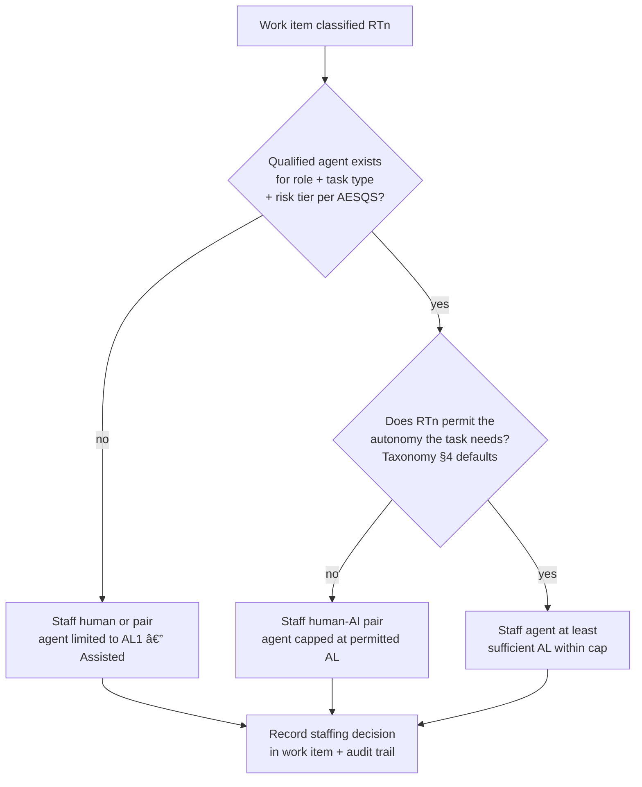

# AEOS Operating Model

| | |
|---|---|
| **Document ID** | AIES-AEOS-OM-01 |
| **Status** | Review |
| **Audience** | Engineering leadership · Engineers |

The key words "MUST", "MUST NOT", "SHOULD", "SHOULD NOT", and "MAY" in this document are to be interpreted as described in RFC 2119.

This document defines the core operating model for AI-native engineering organizations: how work is intaken, classified, staffed, executed, gated, and audited. It uses the canonical scales of the [Taxonomy (AIES-SHARED-02 — Taxonomy)](../Shared/Taxonomy/README.md) throughout.

---

## 1. Principles

The operating model rests on four principles. Every other requirement in AEOS derives from one of them.

| # | Principle | Statement |
|---|-----------|-----------|
| 1 | **Human accountability** | A named human is accountable for every engineering outcome, regardless of how the producing role is staffed. Accountability cannot be delegated to an AI system. |
| 2 | **Least autonomy** | A performer is granted the lowest autonomy level sufficient for the task, never the highest level it is qualified for by default. |
| 3 | **Evidence-gated progression** | Autonomy increases only on qualification evidence per [AESQS](../AESQS/README.md), and every grant is reversible. |
| 4 | **Full traceability** | Every significant action — human or AI — is captured in the audit trail (ART-15) with actor, inputs, rationale, and outputs. |

Normative anchors:

- [AIES-AEOS-OM-01-R01 — Operating Model, requirement 01] Every engineering outcome MUST have a named accountable human recorded at work-intake time.
- [AIES-AEOS-OM-01-R02 — Operating Model, requirement 02] Every task assigned to an AI-staffed or pair-staffed role MUST carry a declared autonomy level not exceeding the maximum for its risk tier (Taxonomy §4).
- [AIES-AEOS-OM-01-R03 — Operating Model, requirement 03] Autonomy level grants and increases MUST cite current AESQS qualification evidence and MUST be revocable without notice.
- [AIES-AEOS-OM-01-R04 — Operating Model, requirement 04] Every artifact MUST carry provenance sufficient to reconstruct who or what produced it, from which inputs, under which autonomy level and approvals.

## 2. Work Intake and Flow

All work — features, defects, architecture changes, operational actions — enters the operating model as a **work item (ART-05)** and flows through the SDLC phases P01–P16 relevant to its type. Phases are logical, not strictly sequential; iterative delivery maps onto them repeatedly.

```
  Intake                Classification            Execution                    Closure
┌──────────┐   ┌──────────────────────────┐   ┌──────────────────────┐   ┌──────────────┐
│ Work item │──►│ Risk tier (RT1 — Minimal through RT4 — Critical) │──►│ Phase work by roles  │──►│ Gate(s) pass │
│ (ART-05)  │   │ Max autonomy (AL cap)    │   │ (P01–P16 as needed)  │   │ Artifacts    │
│ Accountable│  │ Staffing decision        │   │ Artifacts + evidence │   │ linked, audit│
│ human named│  │ (human / agent / pair)   │   │ Audit trail (ART-15) │   │ trail sealed │
└──────────┘   └──────────────────────────┘   └──────────────────────┘   └──────────────┘
```

- [AIES-AEOS-OM-01-R05 — Operating Model, requirement 05] Every work item MUST record, before execution begins: objective, risk tier, accountable human, assigned role(s), staffing choice per role, and declared autonomy level per AI-performed task.
- [AIES-AEOS-OM-01-R06 — Operating Model, requirement 06] Work items MUST be linked to the artifacts they produce, and artifacts MUST link back to their work item (bidirectional traceability).
- [AIES-AEOS-OM-01-R07 — Operating Model, requirement 07] Risk tier classification MUST be performed before staffing and autonomy decisions, and MUST be re-evaluated when the scope of a work item changes materially.

Typical phase involvement by work type (informative):

| Work type | Primary phases | Reference workflow |
|-----------|----------------|--------------------|
| Feature delivery | P02–P13 | [Workflows §2](workflows.md#2-feature-delivery-p02p13) |
| Defect fix | P09–P13 | [Workflows §3](workflows.md#3-defect-fix) |
| Architecture change | P06–P07 | [Workflows §4](workflows.md#4-architecture-change-adr-flow) |
| Incident response | P14–P15 | [Workflows §5](workflows.md#5-incident-response-p14p15) |
| Knowledge update | X09 | [Workflows §6](workflows.md#6-knowledge-update-x09-loop) |

## 3. Role Staffing

Every role (ROLE-01 … ROLE-14) can be staffed three ways; the role's responsibilities are constant across all three:

| Staffing mode | Description | Accountability |
|---------------|-------------|----------------|
| **Human** | A qualified person performs the role | The person |
| **AI agent** | A qualified agent (ART-14 agent definition) performs the role within an autonomy envelope | The accountable human named at intake |
| **Human-AI pair** | Human and agent jointly hold the role; the human decides | The human in the pair |

Exceptions:

- [AIES-AEOS-OM-01-R08 — Operating Model, requirement 08] ROLE-13 (Human Approver) and ROLE-14 (Governance Officer) MUST be staffed by humans. An AI system MAY assist these roles (e.g., summarizing decision context) but MUST NOT hold their decision authority.

## 4. Staffing Decision Procedure

Staffing is decided per role, per work item, as a function of **risk tier × available qualifications**:



- [AIES-AEOS-OM-01-R09 — Operating Model, requirement 09] A role on a work item MUST NOT be staffed by an AI agent unless the agent holds a current AESQS qualification covering that role, that task type, and that risk tier.
- [AIES-AEOS-OM-01-R10 — Operating Model, requirement 10] Staffing decisions and their rationale MUST be recorded in the work item and audit trail.
- [AIES-AEOS-OM-01-R11 — Operating Model, requirement 11] For RT4 — Critical work, roles SHOULD be staffed by humans or human-AI pairs; agent staffing at RT4 — Critical is limited to AL1 — Assisted (assisted) participation.
- [AIES-AEOS-OM-01-R12 — Operating Model, requirement 12] Staffing MAY be revised mid-work-item (e.g., pair to human after repeated escalation), and any revision MUST be recorded.

## 5. Autonomy Assignment

Autonomy is assigned **per task type, per risk tier** — never globally to an agent (Taxonomy §3). The assignment procedure:

1. **Determine the cap.** The risk tier sets the maximum permissible autonomy level per the RT→AL defaults in [Taxonomy §4](../Shared/Taxonomy/README.md#4-risk-tiers-rt1rt4): RT1 — Minimal→AL4 — Autonomous, RT2 — Moderate→AL3 — Delegated, RT3 — Significant→AL2 — Collaborative, RT4 — Critical→AL1 — Assisted. Organizations MAY tighten these; loosening requires documented risk acceptance per [AIES-AEOS-GOV-01 — Governance Operations](governance-operations.md).
2. **Determine qualified level.** Look up the agent's AESQS qualification for the (role, task type) pair. The qualification states the highest AL for which evidence exists.
3. **Assign the minimum sufficient level.** Assign `min(cap, qualified level, level the task actually needs)` — the least-autonomy principle.
4. **Define the envelope.** Record the resulting autonomy envelope: permitted actions, resources, decision scope, and the gates that apply (per [AIES-AEOS-HO-01 — Human Oversight](human-oversight.md)).
5. **Record the grant.** The grant, its evidence citation, its expiry or review date, and the granting Human Approver are written to the audit trail.

- [AIES-AEOS-OM-01-R13 — Operating Model, requirement 13] Autonomy assignments MUST follow the procedure above; step 3's minimum rule MUST NOT be bypassed for convenience.
- [AIES-AEOS-OM-01-R14 — Operating Model, requirement 14] Every autonomy grant MUST specify an expiry or scheduled review date; grants without review MUST lapse to AL1 — Assisted.
- [AIES-AEOS-OM-01-R15 — Operating Model, requirement 15] Autonomy promotion (raising an agent's qualified level) MUST follow the promotion workflow in [Workflows §7](workflows.md#7-autonomy-level-promotion), which requires AESQS re-qualification.
- [AIES-AEOS-OM-01-R16 — Operating Model, requirement 16] Any human with role authority over a task MAY unilaterally lower its effective autonomy level at any time; lowering never requires approval.

## 6. Artifact and Provenance Requirements

Roles produce the canonical artifacts (ART-01 … ART-15) of [Taxonomy §7](../Shared/Taxonomy/README.md#7-artifact-types). Provenance requirements apply uniformly:

- [AIES-AEOS-OM-01-R17 — Operating Model, requirement 17] Every artifact MUST record: producing role and staffing mode; performer identity (person, agent definition ID and version, or both); declared autonomy level; source work item; material inputs (including context assets ART-13 for AI performers); and the approvals it has passed.
- [AIES-AEOS-OM-01-R18 — Operating Model, requirement 18] AI-produced or AI-modified content within an artifact MUST be distinguishable from human-authored content at the granularity the artifact type supports (e.g., per commit for ART-06).
- [AIES-AEOS-OM-01-R19 — Operating Model, requirement 19] Artifacts that pass a gate MUST be immutable thereafter; corrections create new versions with links to the superseded version.
- [AIES-AEOS-OM-01-R20 — Operating Model, requirement 20] Agent definitions (ART-14) MUST be versioned, and every agent action MUST record the definition version in effect.

## 7. Escalation Model

Escalation transfers a decision from an AI system to a human, or from a lower to a higher authority. Four mandatory escalation triggers:

| Trigger | Condition | Escalates to | Required response |
|---------|-----------|--------------|-------------------|
| **Envelope breach** | Task requires an action outside the autonomy envelope | Human Approver (ROLE-13) | Approve as one-off, extend envelope via grant procedure (§5), or reassign |
| **Low confidence** | Performer cannot meet the task's quality bar with available information (self-assessed or evaluator-flagged) | Role owner / pair human | Supply context, take over, or split the task |
| **Gate failure** | Artifact fails a quality or approval gate | Producing role, then role owner after repeated failure | Rework; after N failures (org-defined, default 2) staffing is reviewed per R12 |
| **Incident** | Work causes or is implicated in an operational incident | SRE (ROLE-10) + Governance Officer (ROLE-14) | Incident response workflow ([Workflows §5](workflows.md#5-incident-response-p14p15)); implicated agent's tasks suspended pending review |

- [AIES-AEOS-OM-01-R21 — Operating Model, requirement 21] Agents MUST escalate rather than act when any trigger condition is met; guardrails MUST enforce the envelope-breach trigger independently of the agent's own judgment.
- [AIES-AEOS-OM-01-R22 — Operating Model, requirement 22] Every escalation MUST be recorded in the audit trail with trigger, context, receiving human, decision, and rationale.
- [AIES-AEOS-OM-01-R23 — Operating Model, requirement 23] Escalation paths MUST be defined before an agent begins work; a task with no reachable escalation target MUST NOT proceed above AL1 — Assisted.
- [AIES-AEOS-OM-01-R24 — Operating Model, requirement 24] Escalation rates per agent and per task type MUST be tracked as operating metrics per [AIES-AEOS-GOV-01 — Governance Operations §8](governance-operations.md#8-metrics).

## Related Documents

- [Role Catalog (AIES-AEOS-ROLE-00 — Role Model)](roles/README.md) — who performs the work
- [Workflows (AIES-AEOS-WF-01 — Workflows)](workflows.md) — how roles collaborate
- [Human Oversight (AIES-AEOS-HO-01 — Human Oversight)](human-oversight.md) — how gates are designed and operated
- [Governance Operations (AIES-AEOS-GOV-01 — Governance Operations)](governance-operations.md) — how the model is governed and measured

## References

- RFC 2119 — Key words for use in RFCs to Indicate Requirement Levels
- RFC 8174 — Ambiguity of Uppercase vs Lowercase in RFC 2119 Key Words
