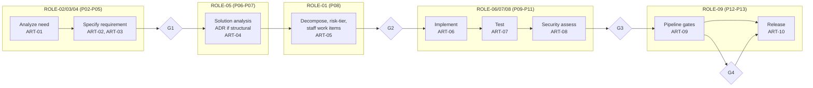
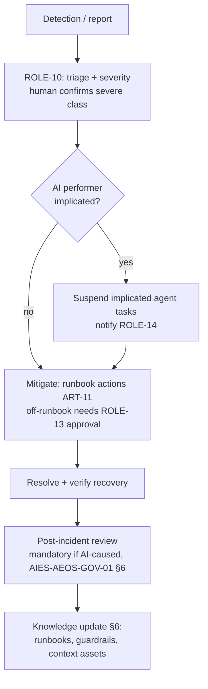

# AEOS Standard Workflows

| | |
|---|---|
| **Document ID** | AIES-AEOS-WF-01 |
| **Status** | Review |
| **Audience** | Engineers · Engineering leadership |

The key words "MUST", "MUST NOT", "SHOULD", "SHOULD NOT", and "MAY" in this document are to be interpreted as described in RFC 2119.

This document defines the standard collaboration workflows of the AEOS operating model. Each workflow specifies its trigger, participating roles, steps, gates, artifacts, and failure/rollback paths. Gate types (pre-execution approval, per-item review, checkpoint review, sampling audit, post-hoc audit) are defined in [Human Oversight §2 (AIES-AEOS-HO-01 — Human Oversight)](human-oversight.md#2-gate-taxonomy).

## 1. General Requirements

- [AIES-AEOS-WF-01-R01 — Workflows, requirement 01] Every workflow execution MUST be anchored to a work item (ART-05) and produce audit trail records (ART-15) at each step and gate.
- [AIES-AEOS-WF-01-R02 — Workflows, requirement 02] Gate placements shown here are minimums for the stated risk tiers; organizations MAY add gates and MUST NOT remove them without documented risk acceptance per [AIES-AEOS-GOV-01 — Governance Operations](governance-operations.md).
- [AIES-AEOS-WF-01-R03 — Workflows, requirement 03] Every role in these workflows follows its specification in the [Role Catalog (AIES-AEOS-ROLE-00 — Role Model)](roles/README.md); staffing (human / agent / pair) is decided per [Operating Model §4 (AIES-AEOS-OM-01 — Operating Model)](operating-model.md#4-staffing-decision-procedure).

---

## 2. Feature Delivery (P02→P13)

**Trigger:** An approved product objective enters the backlog.
**Participating roles:** ROLE-02, ROLE-03, ROLE-04, ROLE-05, ROLE-01, ROLE-06, ROLE-07, ROLE-08, ROLE-09, ROLE-13, with ROLE-11 (X08) throughout.



**Steps and gates:**

| Step | Role(s) | Output | Gate |
|------|---------|--------|------|
| 1. Requirement analysis | ROLE-02/03/04 | ART-01, ART-02, ART-03 | **G1** — per-item review: requirements approved for planning (human review mandatory for AI-produced requirements per [AIES-AEOS-ROLE-02 — ROLE-02 — Business Analyst](roles/ROLE-02-business-analyst.md)) |
| 2. Solution/architecture | ROLE-05 | ART-04 (if structural — see §4) | ADR acceptance per [AIES-AEOS-ROLE-05 — ROLE-05 — Architect](roles/ROLE-05-architect.md) |
| 3. Planning | ROLE-01 | ART-05 with risk tiers, staffing, AL grants | **G2** — pre-execution approval of plan and autonomy grants (ROLE-13) for RT3 — Significant and above items |
| 4. Implementation | ROLE-06 | ART-06 | Automated quality gates on every change; per-item review at AL2 — Collaborative |
| 5. Test and security | ROLE-07, ROLE-08 | ART-07, ART-08 | **G3** — quality gate: tests pass, coverage per strategy, security sign-off (human for RT3 — Significant and above per [AIES-AEOS-ROLE-08 — ROLE-08 — Security Engineer](roles/ROLE-08-security-engineer.md)) |
| 6. Release | ROLE-09, ROLE-03 | ART-09 execution, ART-10 | **G4** — release approval (pre-execution approval): ROLE-13 approves deployment (RT3 — Significant and above), ROLE-03 (human) accepts product scope |

**Failure/rollback paths:**

- G1/G2 failure → return to the producing role with recorded reasons; re-tiering if scope changed ([AIES-AEOS-OM-01-R07 — Operating Model, requirement 07](operating-model.md#2-work-intake-and-flow)).
- G3 failure → return to ROLE-06; after the org-defined repeat threshold (default 2), staffing review per [AIES-AEOS-OM-01-R12 — Operating Model, requirement 12](operating-model.md#4-staffing-decision-procedure).
- G4 failure or post-release regression → rollback via ROLE-09's verified mechanism; regression in production triggers the Defect Fix (§3) or Incident Response (§5) workflow.

## 3. Defect Fix

**Trigger:** A defect is reported (user, QA, telemetry, or audit finding).
**Participating roles:** ROLE-07, ROLE-01, ROLE-06, ROLE-09, ROLE-13; ROLE-10 if production-detected.

```
ROLE-07  ── reproduce, characterize ──► ART-07 (failing test)
ROLE-01  ── classify: severity + risk tier, create work item ──► ART-05
ROLE-06  ── fix with regression test ──► ART-06
   gates ── automated gates ──► per-item review (AL2 — Collaborative / RT3 — Significant and above) ──► [G: quality]
ROLE-09  ── deliver via pipeline ──► ART-10
ROLE-07  ── verify in target environment, close ──► ART-07 (passing)
```

**Steps:**

1. **Reproduce (ROLE-07):** capture the defect as a failing test before any fix; unreproducible defects escalate to ROLE-10 for observability improvement.
2. **Classify (ROLE-01):** severity and risk tier — a defect fix inherits at least the risk tier of the code it touches, not of the symptom.
3. **Fix (ROLE-06):** minimal change plus regression test; scope creep beyond the defect is an envelope breach.
4. **Gate:** automated gates always; per-item human review for AL2 — Collaborative performers and all RT3 — Significant and above fixes.
5. **Deliver and verify (ROLE-09, ROLE-07):** release per pipeline; verify the failing test now passes in the target environment.

- [AIES-AEOS-WF-01-R04 — Workflows, requirement 04] A defect fix MUST include a regression test that failed before the fix and passes after; exceptions require documented justification at the gate.

**Failure/rollback:** fix rejected at gate → back to step 3. Fix causes new regression → rollback and reopen. Defect recurs → mandatory root-cause analysis feeding the Knowledge Update loop (§6).

## 4. Architecture Change (ADR Flow)

**Trigger:** A proposed change to system structure — new component, technology adoption, boundary change, or reversal of a prior decision.
**Participating roles:** ROLE-05, ROLE-08, ROLE-06, ROLE-13, ROLE-14 (RT4 — Critical impact only), ROLE-12.

```
Proposer (any role) ──► ROLE-05: draft ADR ──► ART-04 (Proposed)
                              │  context, ≥2 options, trade-offs, impact tier
                              ▼
                    Review: ROLE-08 (security), affected ROLE-06/09/10
                              │
                              ▼
              [G: ADR acceptance] ── RT1 — Minimal to RT2 — Moderate: ROLE-05 within envelope
                              │      RT3 — Significant and above: human ROLE-05 + ROLE-13
                              │      RT4 — Critical: + ROLE-14 (irreversibility check)
                              ▼
                    ART-04 (Accepted) ──► implementation work items (ART-05)
                              │
                              ▼
                    ROLE-12: index into context assets (ART-13)
```

**Steps:**

1. Draft ADR (ROLE-05) with context, at least two options, trade-offs, and impact risk tier ([AIES-AEOS-ROLE-05 — ROLE-05 — Architect](roles/ROLE-05-architect.md)).
2. Technical review by security (ROLE-08) and the roles that will implement and operate the change.
3. Acceptance gate scaled by impact tier (see diagram).
4. Decompose into implementation work items; each follows Feature Delivery (§2) gates.
5. Knowledge update (ROLE-12): the accepted ADR enters context assets so future work — human and agent — is grounded in it.

- [AIES-AEOS-WF-01-R05 — Workflows, requirement 05] Structural changes MUST NOT be implemented without an accepted ADR; retroactive ADRs are a governance finding.

**Failure/rollback:** ADR rejected → recorded with rationale (rejected ADRs are retained — they are knowledge). Implementation reveals wrong assumptions → new superseding ADR, never silent divergence. Superseded ADRs are marked, and ROLE-12 updates context assets in the same change.

## 5. Incident Response (P14–P15)

**Trigger:** An operational anomaly breaching defined thresholds, or any report of production harm.
**Participating roles:** ROLE-10 (incident command), ROLE-09, ROLE-06, ROLE-08 (if security), ROLE-13, ROLE-14 (if AI-caused), ROLE-11/12 (post-incident).



**Steps and gates:**

1. **Triage (ROLE-10):** classify severity; human confirmation required for severe classes ([AIES-AEOS-ROLE-10 — ROLE-10 — SRE](roles/ROLE-10-sre.md)).
2. **Containment:** if an AI performer is implicated, its tasks are suspended immediately ([AIES-AEOS-OM-01 — Operating Model §7](operating-model.md#7-escalation-model)) and ROLE-14 is notified.
3. **Mitigation (ROLE-10/09):** pre-approved runbook actions execute within envelope; off-runbook production actions require ROLE-13 approval (**gate: pre-execution approval**). The kill-switch ([AIES-AEOS-HO-01 — Human Oversight §6](human-oversight.md#6-override-and-kill-switch)) is always available without approval.
4. **Resolution and verification:** recovery is verified with telemetry (ART-12 evidence), not assumed.
5. **Post-incident review:** mandatory for AI-caused incidents per [AIES-AEOS-GOV-01 — Governance Operations §6](governance-operations.md#6-incident-classification-and-post-incident-review); blameless for humans, evidentiary for agent qualifications.

**Artifacts:** incident record and timeline (ART-15), updated ART-11 runbooks, ART-12 report, corrective work items (ART-05).

**Failure paths:** mitigation ineffective → escalate severity and widen command. Implicated-agent analysis shows qualification gap → AESQS re-qualification and possible autonomy demotion (§7 in reverse, which requires no ceremony — demotion is always immediate per [AIES-AEOS-OM-01-R16 — Operating Model, requirement 16](operating-model.md#5-autonomy-assignment)).

## 6. Knowledge Update (X09 Loop)

**Trigger:** Any event producing reusable lessons: retrospective, post-incident review, ADR acceptance, recurring escalation pattern, or evaluation report (ART-12) findings.
**Participating roles:** ROLE-12 (owner), ROLE-11, source-event roles, ROLE-13 (activation gate for AL3 — Delegated+ consumed assets).

```
Event (retro / PIR / ADR / ART-12) 
      │
      ▼
ROLE-12: capture candidate lesson ──► draft ART-13 change (versioned)
      │
      ▼
Validation: owning role confirms accuracy; ROLE-11 aligns documentation
      │
      ▼
[G: activation review] ── per-item human review if consumed by AL3 — Delegated and above agents
      │                    (AIES-AEOS-ROLE-12-R01); automated secret/PII scan always
      ▼
Activate new ART-13 version ──► agents and humans consume on next task
      │
      ▼
ROLE-12: measure effect (defect/escalation deltas) ──► ART-12 ──► loop
```

**Steps:** capture → validate with the knowledge's owning role → gate → activate → measure effectiveness → feed measurements back as the next loop's trigger.

- [AIES-AEOS-WF-01-R06 — Workflows, requirement 06] Knowledge updates MUST be versioned context-asset changes traceable to their triggering event; direct undocumented edits to agent-consumed assets are prohibited.

**Failure paths:** validation disputes → escalate to the owning role for resolution before encoding ([ROLE-12 — Knowledge Manager escalation duties](roles/ROLE-12-knowledge-manager.md)). Activated asset correlates with quality regression → immediate rollback to prior version (assets are versioned precisely for this) and re-entry of the loop.

## 7. Autonomy Level Promotion

**Trigger:** Sustained evidence that a performer (typically an agent, for a specific role and task type) operates reliably above its current grant — e.g., high gate pass rates and low escalation-override rates at the current level.
**Participating roles:** role owner (proposer), ROLE-12 (evidence assembly), AESQS evaluation function, ROLE-13 (grant), ROLE-14 (RT-default exceptions only).

```
Evidence accumulation          AESQS re-qualification            New envelope
┌────────────────────┐   ┌──────────────────────────────┐   ┌─────────────────────┐
│ ART-12 + ART-15:   │   │ Structured evaluation at the  │   │ ROLE-13 grants per  │
│ gate pass rates,   │──►│ target AL: EV1-EV6 scoring,   │──►│ AIES-AEOS-OM-01 §5:      │
│ escalation quality,│   │ adversarial cases, task-type  │   │ envelope, gates,    │
│ audit findings at  │   │ scope per AESQS               │   │ expiry/review date, │
│ current AL         │   │                               │   │ recorded in ART-15  │
└────────────────────┘   └──────────────┬────────────────┘   └──────────┬──────────┘
                                        │ fail                          │
                                        ▼                               ▼
                              remain at current AL;          probation: elevated sampling
                              gap analysis → §6 loop         audit until confirmed
```

**Steps:**

1. **Propose:** role owner nominates (performer, role, task type, target AL); target MUST NOT exceed the RT→AL cap for the work involved.
2. **Assemble evidence:** operating telemetry from the current level — gate pass rates, escalation appropriateness, audit findings, incident involvement.
3. **Re-qualify (AESQS):** structured evaluation at the *target* level, scored on EV1–EV6, including adversarial and edge cases; operating history alone is not sufficient.
4. **Grant (ROLE-13):** on pass, a new envelope is issued per the [assignment procedure](operating-model.md#5-autonomy-assignment), with expiry/review date.
5. **Probation:** the new level operates under elevated sampling-audit frequency for an org-defined period before the grant is confirmed.

- [AIES-AEOS-WF-01-R07 — Workflows, requirement 07] Autonomy promotion MUST include AESQS re-qualification at the target level; operating telemetry alone MUST NOT justify a grant.
- [AIES-AEOS-WF-01-R08 — Workflows, requirement 08] Promotion grants MUST begin with a probation period of elevated oversight; probation findings MAY revert the grant without ceremony.

**Failure paths:** re-qualification failure → performer remains at current level; the gap analysis feeds the Knowledge Update loop (§6) — often the fix is better context assets, not a different performer. Probation regression → immediate reversion ([AIES-AEOS-OM-01-R16 — Operating Model, requirement 16](operating-model.md#5-autonomy-assignment)) and a governance record of why.

## Related Documents

- [Operating Model (AIES-AEOS-OM-01 — Operating Model)](operating-model.md) — work intake, staffing, autonomy assignment, and escalation these workflows implement
- [Role Catalog (AIES-AEOS-ROLE-00 — Role Model)](roles/README.md) — the roles that participate in each workflow
- [Human Oversight (AIES-AEOS-HO-01 — Human Oversight)](human-oversight.md) — the gate taxonomy the workflow gates draw on
- [Governance Operations (AIES-AEOS-GOV-01 — Governance Operations)](governance-operations.md) — risk acceptance, incident classification, and metrics

## References

- RFC 2119 — Key words for use in RFCs to Indicate Requirement Levels
- RFC 8174 — Ambiguity of Uppercase vs Lowercase in RFC 2119 Key Words
