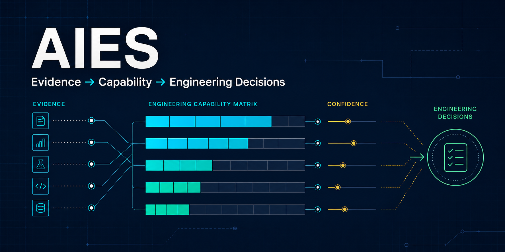

# AI Engineering Standards (AIES)

> **Turn AI engineering behavior into evidence you can inspect, compare, and act on.**


-lightgrey)




Models, coding assistants, agents, and engineering platforms are often chosen
from anecdotes or one opaque benchmark number. AIES produces a traceable
Engineering Capability Matrix (ECM): what the assessed subject did well, where
the evidence is thin, what was not assessed, and where engineering review is
appropriate.

### Try the complete product offline

```powershell
cd platform
py -m venv .venv
.\.venv\Scripts\Activate.ps1
python -m pip install -e .
aies demo --open
```

On macOS or Linux, use `python3 -m venv .venv`, then
`source .venv/bin/activate` before the same install and demo commands. AIES
never requires `--break-system-packages`. Existing isolated-tool users may
instead run `pipx install ./platform` or `uv tool install ./platform` from the
repository root.

No model server. No API key. No Make or Bash. No mandatory human-review loop.
The command executes the real collection, batched scoring, analysis, ECM,
Engineering Fit, and linked HTML report pipeline using deterministic mock
deployments.

```text
AIES  EVIDENCE → CAPABILITY → ASSURANCE → ENGINEERING DECISIONS

TASK                         EVIDENCE  OBSERVED CAPABILITY  SCENARIO BREADTH
ET-02 — Architecture Design  2/20      █████████░ 85%       █░░░░░░░░░ 10%
ET-04 — Code Generation      2/20      █████████░ 92%       █░░░░░░░░░ 10%
ET-07 — Testing              2/20      █████████░ 90%       █░░░░░░░░░ 10%

Coverage: assessed tasks are observed; unassessed tasks remain unknown, not zero.
```

That separation matters: AIES does not relabel scenario count as confidence.
It reports observed performance, direct scenario breadth, and evidence
assurance—including reviewer calibration, mapping review, instrument maturity,
and optional human evaluation—as different facts.

**Start here:** [60-second offline trial](QUICKSTART.md) ·
[choose a path by role](GETTING_STARTED.md) ·
[see every CLI command](platform/CLI_REFERENCE.md) ·
[review the public roadmap](ROADMAP.md) ·
[see the adoption and launch plan](docs/ADOPTION_AND_LAUNCH_PLAN.md) ·
[adopt it in CI](platform/CI_INTEGRATION.md) ·
[run it in a container](platform/CONTAINER.md) ·
[help build it](CONTRIBUTING.md) ·
[share first-run or report feedback](https://github.com/umairali7/ai-engineering-standards/issues/new/choose)

### What can you use today?

| You want to… | Start with | You receive |
|---|---|---|
| See the idea without setup | `aies demo --open` | Executive Summary, ECM, fit guidance, diagnostics, and full report |
| Understand one registered AI deployment | `aies evaluate DEPLOYMENT --plan-only` | Non-executing call plan, declared cost/ETA or exact unknowns, limitations, resumability, and execution path |
| Evaluate it automatically | `aies evaluate DEPLOYMENT --judge JUDGE` | Completed non-blocking Engineering Evaluation and report bundle |
| See the decision snapshot in your terminal | `aies snapshot latest` | Task evidence, observed capability, scenario breadth, assurance gaps, and engineering interpretation |
| Check what AIES truly supports | `aies support` | Implemented, experimental, and planned subject kinds with executable entry points and limitations |
| Choose a first workflow by decision | `aies starter list` | Prerequisites, commands, artifacts, time/cost class, evidence breadth, limitations, and next expansion |
| Assess a repository from multiple engineering perspectives | `aies audit . --out aies-repository-report` | Separate practice maturity, architecture, code-quality, correctness-assurance, security, dependency, confidence, limitation, and evidence-linked remediation views |
| Add advisory repository evidence to CI | `aies ci audit . --rt 2` | Retained JSON/Markdown evidence and annotations without an implicit merge gate |
| Run without a host Python install | `docker build -f platform/Dockerfile -t aies:local .` | Non-root container for demo, audit, conformance, and networked evaluations |
| Bring a run from another machine | `aies runs import RUN.zip --dry-run` | Traversal-safe validation, byte/digest verification, non-overwriting import, and an append-only receipt |
| Compare 2–5 compatible deployment runs or repository snapshots | `aies compare REF_A REF_B [REF_C ...] --sort spread --out comparison` | Adaptive pair/matrix evidence in Markdown, JSON, and sortable HTML without a fake universal winner |
| Integrate an evaluation tool | `aies bridge inspect-import …` | Source-bound imported ratings and an explicit loss report |
| Integrate static analysis | `aies bridge sarif-import …` | Preserved SARIF findings that remain distinct from correctness claims |
| Apply formal governance | `--formal-qualification` | A separate human-governed qualification path |

Current implemented subjects are AI deployments and repositories. The
subject-neutral contracts for agents, MCP servers, RAG systems, pipelines, and
platforms are experimental until their dedicated executors and instruments are
implemented and validated. The generated
[Subject Support Matrix](platform/SUBJECT_SUPPORT.md) and `aies support` command
are the canonical public support boundary.

---

## Vision

Artificial Intelligence is fundamentally changing software engineering.

Organizations are rapidly adopting AI assistants, coding agents, autonomous workflows, and AI-native engineering platforms. Despite this transformation, there is no comprehensive, vendor-neutral engineering standard defining how AI should participate across the complete Software Development Life Cycle (SDLC).

The **AI Engineering Standards (AIES)** project exists to establish that
standard: a practical, engineering-first framework that enables organizations
to build, evaluate, compare, govern, certify, and operate trustworthy
AI-native software engineering systems at enterprise scale.

AIES is not confined to evaluating models. Its canonical evidence architecture
is subject-neutral. The current reference implementation assesses **AI
deployments** and **software repositories**. The same contracts are intended to
support dedicated assessment adapters for AI agents, agent swarms, MCP servers,
AI coding assistants, prompt libraries, RAG systems, AI pipelines, AI
platforms, and composite systems as those adapters are implemented and
validated.

See the full [Vision](docs/VISION.md) and [Project Charter](docs/PROJECT_CHARTER.md).

## Mission

Build the world's most comprehensive **vendor-neutral engineering standard for AI Engineering** — the equivalent for this discipline of what these standards are for theirs:

| Discipline | Industry Standard |
|------------|-------------------|
| Project Management | PMBOK |
| Business Analysis | BABOK |
| Enterprise Architecture | TOGAF |
| Application Security | OWASP ASVS |
| Software Testing | ISTQB |
| **AI Engineering** | **AIES** |

## Why This Project Exists

Current AI engineering practice suffers from recurring gaps:

- No common engineering vocabulary
- No standard AI-native SDLC methodology
- No objective capability evaluation framework
- No engineering competency model
- No standard AI operating model
- Heavy dependence on specific vendors or models
- Limited governance and auditability
- Inconsistent quality across AI systems

AIES addresses these gaps through an open, extensible, engineering-driven standard.

---

## From Evidence to Engineering Decisions

AIES separates evidence from the different decisions people need to make from
it:

```text
Assessment
    ↓
Canonical Evidence
    ↓
Competency Analysis
    ↓
Engineering Capability Matrix (ECM)
    ↓
Engineering Fit, Comparison, and Optional Formal Qualification
```

The outputs serve different audiences and must not be collapsed into one
opaque score:

| Decision product | Primary audience | What it answers | Human evaluation required? |
|---|---|---|---|
| **Engineering Evaluation** | Engineers and evaluators | What was observed, under which conditions, and with what evidence? | No; automated scores are sufficient for the engineering result |
| **Engineering Capability Matrix (ECM)** | Engineers and technical leaders | Which engineering tasks are demonstrated strengths, weaker areas, or evidence gaps? | No; human evaluation is an optional, visible corroboration |
| **Engineering Fit Guidance** | Engineering managers and platform teams | Where is this subject a good fit, where should review be used, and where is evidence insufficient? | No; informational only and never deployment authority |
| **Formal Qualification** | Auditors and qualification authorities | Does the evidence satisfy a governed, risk-scoped qualification protocol? | Yes; explicitly requested with `--formal-qualification` |
| **Qualification Record** | Governance and accountable leadership | What consequential qualification decision did a named human authority record? | Yes |

Routine assessment, benchmarking, analysis, comparison, and reporting are
therefore **non-blocking**: missing human review is reported as `not performed`,
not treated as a failure. Human accountability remains mandatory for
consequential grants, releases, deployments, and other governed decisions.

### Engineering Capability Matrix

The ECM is the engineer-facing core artifact defined around a stable,
subject-neutral Engineering Task Taxonomy:

| ID | Engineering task | ID | Engineering task | ID | Engineering task |
|---|---|---|---|---|---|
| ET-01 | Requirements Analysis | ET-06 | Debugging | ET-11 | Database Design |
| ET-02 | Architecture Design | ET-07 | Testing | ET-12 | Migration |
| ET-03 | API Design | ET-08 | Documentation | ET-13 | Infrastructure |
| ET-04 | Code Generation | ET-09 | Performance Optimization | ET-14 | Observability |
| ET-05 | Refactoring | ET-10 | Security Review | ET-15 | Production Operations |

For every applicable task, the ECM reports observed performance separately
from scenario breadth, reviewer assurance, mapping review, instrument maturity,
optional human evaluation, coverage, and provenance. `Not
assessed` means **no supported claim can be made**; it is not a zero-capability
rating. This makes the ECM useful for evidence-compatible subject comparison
and workload selection without turning AIES into a context-free leaderboard.

---

## The Five Modules

| Module | Full Name | Question It Answers | Docs |
|--------|-----------|---------------------|------|
| **AEBOK** | AI Engineering Body of Knowledge | *What should AI Engineering know?* | [AEBOK/](AEBOK/README.md) |
| **AESQS** | AI Engineering SDLC Qualification Standard | *How do we objectively evaluate AI Engineering capability?* | [AESQS/](AESQS/README.md) |
| **AEOS** | AI Engineering Operating System | *How should AI Engineering teams operate?* | [AEOS/](AEOS/README.md) |
| **AEAR** | AI Engineering Architecture Reference | *What should enterprise AI platforms look like?* | [AEAR/](AEAR/README.md) |
| **AECT** | AI Engineering Certification & Training | *How do engineers learn and become certified?* | [AECT/](AECT/README.md) |

All modules build on the [Shared Standards](Shared/README.md) — the canonical [Glossary](Shared/Glossary/README.md), [Taxonomy](Shared/Taxonomy/README.md), and documentation conventions that keep terminology consistent across the entire standard.

```
AI Engineering Standards (AIES)
│
├── Shared Standards ────── vocabulary, taxonomies, conventions (used by all)
│
├── AEBOK ──── knowledge:      disciplines, practices, patterns, SDLC guidance
├── AESQS ──── qualification:  competency model, rubrics, capability scoring
├── AEOS ───── operations:     agent roles, workflows, human oversight, governance
├── AEAR ───── architecture:   reference architectures and industry blueprints
└── AECT ───── certification:  learning paths, labs, exams, credentials
```

## Guiding Principles

1. **Vendor Neutral** — Standards define engineering capabilities, not vendors. Models evolve continuously; engineering standards remain stable.
2. **Engineering First** — Engineering disciplines take precedence over prompt techniques and model-specific optimizations.
3. **Enterprise Ready** — Every recommendation is designed for production environments: governance, security, compliance, auditability, traceability, scalability, reliability, operations.
4. **Human Governed** — AI augments engineers. Humans remain accountable for engineering decisions.
5. **Evidence Driven** — Recommendations are supported by measurable outcomes, repeatable evaluation, and documented trade-offs.
6. **Open & Extensible** — The standards evolve with the AI ecosystem while preserving compatibility through controlled versioning and governance.

## Complete SDLC Coverage

Unlike existing AI frameworks, AIES covers the complete software engineering lifecycle — sixteen phases from Business Strategy through Continuous Improvement — plus fifteen cross-cutting domains (security, privacy, compliance, governance, risk, AI safety, human oversight, and more) that span every phase.

The canonical phase and domain definitions live in [docs/SDLC.md](docs/SDLC.md) and the [Shared Taxonomy](Shared/Taxonomy/README.md).

## Intended Audience

Enterprise engineering organizations, CTOs, engineering directors and managers, enterprise/AI/software architects, platform engineering teams, AI product teams, security teams, QA organizations, researchers, universities, and open source communities.

---

## Repository Structure

```
.
├── README.md                 ← you are here
├── GETTING_STARTED.md        ← entry point: reading paths & adoption guide
├── LICENSE.md                ← open dual-license proposal and current legal status
├── CHANGELOG.md              ← versioned change history
├── ROADMAP.md                ← phased delivery plan
├── GOVERNANCE.md             ← decision-making model
├── CONTRIBUTING.md           ← how to contribute
├── SECURITY.md               ← vulnerability reporting
├── CODE_OF_CONDUCT.md
│
├── docs/                     ← charter, vision, architecture, SDLC, FAQ
│   └── standards/            ← document standards governing every file here
├── Shared/                   ← canonical glossary & taxonomy (normative)
├── AEBOK/                    ← Body of Knowledge
├── AESQS/                    ← Qualification Standard
├── AEOS/                     ← Operating System
├── AEAR/                     ← Architecture Reference
├── AECT/                     ← Certification & Training
│
├── platform/                 ← executable Engineering Assessment Platform
├── conformance/              ← golden evidence packages & conformance runner
├── adr/                      ← Architecture Decision Records
├── templates/                ← document templates
├── examples/                 ← worked examples
├── diagrams/                 ← source diagrams
└── research/                 ← supporting research notes
```

## Documentation Hierarchy

```
README → Project Charter → Standards → Specifications
       → Reference Architectures → Examples → Certification Material
```

Each level becomes more specific: the README orients, the charter scopes, standards define requirements, specifications detail them, reference architectures and examples apply them, and certification material teaches them.

## Engineering Philosophy

Knowledge defines what good engineering looks like. Evidence establishes what
was observed. Capability analysis makes that evidence useful. Qualification is
a separate governed decision, not a prerequisite for engineering insight.

```
Knowledge → Assessment → Evidence → Competency Analysis → ECM
                                                     ├→ Engineering Fit
                                                     ├→ Comparison
                                                     └→ Optional Formal Qualification
                                                            ↓
                                          Operations → Continuous Improvement
```

Certification and training remain connected to this lifecycle through AECT.
The modules and implementation milestones are described in the
[Roadmap](ROADMAP.md).

## Governance

The project follows an engineering governance model described in [GOVERNANCE.md](GOVERNANCE.md):

- Architecture Decision Records ([adr/](adr/README.md))
- Peer review and engineering review
- Public discussion
- Versioned releases

No individual contributor owns the standards. Engineering consensus drives evolution.

**Contract stability (v1.0 freeze).** The architecture has reached a stable
equilibrium; the contracts others build against are frozen and versioned:

- [STABILITY.md](STABILITY.md) — the **v1.0 Architecture Freeze**: frozen
  contracts with versions, the **normative vs reference** distinction, and
  **reference implementation vs conformance suite**.
- [COMPATIBILITY.md](COMPATIBILITY.md) — how contracts evolve (additive-only,
  ADR-for-breaking, deprecation window) — **enforced by CI**, not just prose.
- [CONFORMANCE-POLICY.md](CONFORMANCE-POLICY.md) — what "AIES Conformant" means,
  verified by a data-first conformance suite over a golden Evidence Package corpus.

## Non-Goals

The project does **not** aim to:

- Promote a specific AI vendor
- Publish a context-free model leaderboard or declare one universally “best”
- Replace existing engineering frameworks (it complements PMBOK, TOGAF, ISTQB, etc.)
- Become a prompt library
- Teach programming fundamentals

AIES does support evidence-compatible comparison of scoped assessment runs.
Those comparisons are engineering selection inputs, not universal rankings.
`aies compare` accepts 2–5 runs or deployment IDs, or 2–5 stored repository
assessment IDs, without mixing subject families. It places observed performance
beside direct scenario breadth for deployments and preserves perspective-native
metrics for repositories. It emits a higher-observed leader
or tie only when risk tier, subject kind, profile, task mapping, scoring
semantics, rater protocol, suite versions, repeat structure, evidence-adapter
profiles, and task instruments are compatible. Use `--sort spread` to find the
largest supported differences or `--only-comparable` to hide evidence gaps.
`--out DIRECTORY` writes an immutable Markdown/JSON/sortable-HTML bundle;
`--save` explicitly records the derived comparison for the read-only
`/comparisons` API. Pair and matrix reports expose compatibility failures,
coverage gaps, caveats, and evidence-driven next actions. They remain selection
inputs rather than selection, qualification, deployment, or authorization
decisions.

For cross-machine work, run `aies runs import PATH --dry-run` before importing
a run directory or ZIP. AIES accepts exactly one run, rejects unsafe archive
paths, symlinks, collisions, and overwrite, verifies the complete admitted
tree, and retains a source-bound receipt. `aies runs cohorts` then discovers
groups that share the exact ECM comparison protocol and prints connected
2–5-run commands. Compatibility does not imply independent or representative
evidence.

AIES defines **engineering standards** that remain applicable regardless of the
underlying AI technology.

## Roadmap

| Phase | Deliverable | Status |
|-------|-------------|--------|
| 1 | Repository Foundation | ✅ Complete (v0.3.1) |
| 2 | AEBOK — Body of Knowledge | 🔍 Content complete; independent approval reviews pending |
| 3 | AESQS — Qualification Standard | 🔍 Content complete; independent approval reviews pending |
| 4 | AEOS — Operating System | 🔍 Content complete; independent approval reviews pending |
| 5 | AEAR — Architecture Reference | 🔍 Content complete; independent approval reviews pending |
| 6 | AECT — Certification & Training | 🔍 Content complete; independent approval reviews pending |
| 7 | Reference Implementations | 🚧 Started — platform/conformance references delivered; public pilots outstanding |
| 8 | Engineering Assessment Platform (`aies` CLI) | ✅ M1–M4 delivered; 🚧 hardening and subject expansion |
| 9 | Public Release (v1.0) | ⏳ Planned |

Public milestones are maintained in [ROADMAP.md](ROADMAP.md). Detailed
vision-delivery and cleanup item statuses are maintained in the
[AIES Vision Execution Backlog](docs/OSS_MATURITY_TODO.md).

`Review` means the document is content-complete but not yet ratified. Promotion
to `Approved` requires two recorded reviews by independent non-authors,
resolution or reasoned waiver of every finding, stable IDs for all normative
requirements, and seven-day Maintainer lazy consensus. The v0.5 public-comment
cycle and its disposition record are also still required before v1.0. These
human governance gates cannot be replaced by automated checks or AI review.

## Engineering Assessment Platform

The **[Engineering Assessment Platform](platform/README.md)** (`aies` CLI) is
the executable reference implementation of the AIES evidence architecture. It
collects canonical evidence once and renders audience-specific decision
products without changing the underlying observations.

### Current capabilities

- Assess AI deployments across CA-01 — AI-Native SDLC Foundations through
  CA-12 — Governance, Risk & AI Safety.
- Audit repositories across architecture, correctness, code quality, testing,
  security, operations, governance, documentation, and improvement
  opportunities. Repository analysis content-binds the assessed scope, ingests
  retained JUnit/coverage/SARIF and dependency evidence, emits typed
  observations, and keeps every heuristic or tool limitation explicit; it does
  not execute unfamiliar code or claim that correctness/security is proven.
- Generate Engineering Assessment Results, evidence packages, ECM artifacts,
  Engineering Fit Guidance, reports, and compatible run comparisons.
- Consume the versioned, read-only `report-view.json` contract shared by
  Markdown, HTML, safe exports, and `GET /runs/{id}/report-view`; canonical
  evidence and legacy report contracts remain intact.
- Use automated judges for complete non-blocking evaluation; preserve optional
  human evaluation as a separately attributed column and evidence source.
- Reserve formal qualification for explicit `--formal-qualification` runs and
  named human qualification authorities.
- Show live stage, current work, completed/total items, active worker count,
  elapsed time, rate, and ETA for long-running CLI operations, including a
  one-second heartbeat during long model calls and honest
  calculating/declared/observed ETA states.
- Evaluate the platform's own scenario corpus for coverage, calibration
  metadata, behavioral diversity, duplication, and empirical maturity through
  `aies corpus`.
- Verify decision-engine compatibility against immutable golden Evidence
  Packages through the conformance runner.
- Discover the exact implemented, experimental, and planned subject boundary
  through `aies support` or the read-only `/support` API endpoint.
- Consume one versioned workspace summary through `aies overview`,
  `GET /overview`, or the HTML dashboard. All three are read-only
  presentations over the same facts and compute no assessment outcome.
- Inspect one run through `aies runs show <run-id>` or `GET /runs/{id}`.
  Both expose the same versioned, read-only subject, scope, progress,
  decision-product, and artifact index without requiring knowledge of the
  workspace file layout.

### Typical workflow

Adoption is progressive; users do not need to begin with formal qualification:

| Stage | Goal | Current entry point |
|---|---|---|
| **Try** | See the complete product without credentials or model cost | `aies demo --open` |
| **Evaluate** | Collect and automatically score engineering evidence | `aies qualify … --judge …` or `aies benchmark … --judge …` |
| **Understand** | Read task strengths, scenario breadth, assurance gaps, and fit | `aies snapshot`, `aies capabilities`, `aies guidance`, `aies transcript` |
| **Compare** | Compare compatible observed ECM evidence | `aies compare` |
| **Integrate** | Audit repositories, export evidence, or consume shared read-only workspace and run contracts | `aies audit`, `aies export`, `aies overview`, `aies runs show`, `aies serve` |
| **Govern** | Explicitly invoke formal qualification and human authority | `--formal-qualification`, followed by the governed rater and decision workflow |

From `platform/`, create an isolated Python environment and install the CLI:

```powershell
python -m venv .venv
.\.venv\Scripts\Activate.ps1
python -m pip install -e .
aies doctor
aies discover
```

Run an end-to-end engineering evaluation with a separately registered judge:

```powershell
aies qualify <deployment> --all-areas --rt 2 --judge <judge-deployment> --parallel 4

# Equivalent benchmark-oriented command
aies benchmark <deployment> --all-areas --rt 2 --judge <judge-deployment> --parallel 4
```

Both commands collect responses, score them, aggregate canonical evidence, and
generate the complete report bundle. Human review is optional. Inspect or
compare the decision products with:

```powershell
aies support
aies starter show understand-deployment
aies snapshot <run-id>
aies capabilities <run-id>
aies guidance <run-id>
aies compare <run-a> <run-b>
aies transcript <run-id>
```

Task views default to observed performance from strongest to weakest:
`aies snapshot <run-id> --sort breadth` and
`aies capabilities <run-id> --sort task --ascending` provide deterministic
alternatives, while every generated HTML report table can be re-sorted by
selecting a column heading. Long judge runs distinguish concurrency
(`--parallel`) from responses per judge call (`--judge-batch-size`), report
stage versus command elapsed time, and checkpoint every completed batch.

Use formal qualification only when the governed decision is actually required:

```powershell
aies qualify <deployment> --assessment enterprise --judge <judge-deployment> --formal-qualification
```

See the [platform guide](platform/GUIDE.md) for the complete workflow and the
[CLI reference](platform/CLI_REFERENCE.md) for every command, parameter,
prerequisite, sequence, progress behavior, and recovery path.

### Evidence scope and honest claims

Platform results are always risk-scoped: RT1 — Minimal, RT2 — Moderate, RT3 —
Significant, and RT4 — Critical have different evidence, gate, and autonomy
requirements. An ECM `not assessed` task is an evidence gap, not a negative
capability claim. `--all-areas` covers all competency areas for the selected
risk tier; it does not silently claim coverage outside that scope.

The scenario corpus currently contains **484 validated scenarios across 12
competency areas**, with all 15 engineering tasks directly represented. Every
scenario carries design-time calibration metadata and the validator reports
zero structural warnings or errors. Empirical calibration against a
representative multi-model panel remains outstanding; design quality and
scenario count must not be presented as empirical discrimination.

## Contributing

Contributions are welcome. Every proposal should include an engineering rationale, problem statement, alternatives considered, trade-offs, references, and impact analysis. See [CONTRIBUTING.md](CONTRIBUTING.md).

## Versioning

The standard versions as a whole — Semantic Versioning via git tags and the [CHANGELOG](CHANGELOG.md), per the [Versioning Standard (AIES-STD-05 — Versioning Standard)](docs/standards/versioning-standard.md):

| Version | Status |
|---------|--------|
| v0.x | Research & Draft |
| v1.x | Stable Standards |
| v2.x | Major Evolution |

Individual documents carry a lifecycle status only (Draft → Review → Approved → Deprecated) per the [Review Standard (AIES-STD-06 — Review Standard)](docs/standards/review-standard.md) — no per-document versions or dates; git history is the system of record.

## Current Status

- **Standards:** Internal review cycle complete for all module documents; AEBOK,
  AESQS, AEOS, AEAR, and AECT are in Review for v0.4.0.
- **Platform:** Functional reference implementation with engineering
  evaluation, repository audit, ECM, fit guidance, comparison, reporting,
  conformance, and optional formal qualification; hardening and subject-adapter
  expansion remain in progress under
  [ADR-0009](adr/ADR-0009-Engineering-Assessment-Platform-Identity.md).
- **Verified baseline:** 484 scenarios across 12 competency areas with zero
  suite warnings/errors; 248 platform tests passing at the latest local
  verification. Empirical panel calibration and an independent pilot remain
  open.
- **ECM standardization:** The ECM implementation and ET-01 through ET-15
  taxonomy are delivered; formal ratification of AIES-ECM-01 and integration
  into the five-module standards architecture remain open governance work.
- **Status:** Active Development.

## License

AIES is committed to an open-source release. The exact terms will be finalized
before v1.0. Proposed
[ADR-0014](adr/ADR-0014-Dual-License-Standards-and-Software.md) recommends
**CC BY-SA 4.0** for standards and reusable assessment content and **Apache
2.0** for executable software. Until that Class 3 decision is ratified, no
license is granted; see [LICENSE.md](LICENSE.md) and [docs/FAQ.md](docs/FAQ.md).

---

> **AI Engineering Standards (AIES)** is an open initiative to define the future of AI-native software engineering through vendor-neutral, engineering-first standards.
