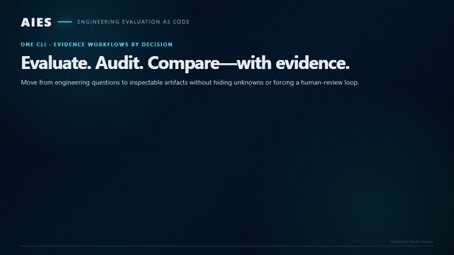

# AI Engineering Standards (AIES)

> **Evidence-backed Engineering Evaluation as Code. See what an AI engineering
> system can actually do, how much evidence supports it, and where the unknowns
> remain.**

[](https://github.com/umairali7/ai-engineering-standards/actions/workflows/platform-ci.yml)
[](https://github.com/umairali7/ai-engineering-standards/actions/workflows/security.yml)


**A leaderboard can tell you who won its benchmark. It cannot tell you whether
a model should design your API, refactor a payment path, review a security
boundary, or operate inside your repository.**

AIES turns versioned engineering scenarios and repository evidence into a
traceable **Engineering Capability Matrix (ECM)**: demonstrated strengths,
weaker areas, evidence breadth, assurance gaps, and tasks that were not
assessed. No mystery aggregate. No invented confidence. No universal “best
model” claim.

**[Try it offline](#try-the-complete-product-offline)** ·
**[Choose a workflow](#choose-your-first-workflow)** ·
**[See the difference](#why-this-is-different)** ·
**[Read the standards](GETTING_STARTED.md)** ·
**[Help build it](CONTRIBUTING.md)**

## What you get

| Evidence product | The decision it helps you make |
|---|---|
| **Engineering Capability Matrix** | What did this subject demonstrate across architecture, APIs, code, testing, security, performance, operations, and other engineering tasks? |
| **Engineering Fit Guidance** | Where is the subject a reasonable fit, where should review be used, and where is the evidence insufficient? |
| **Compatible comparison** | Which differences between 2–5 runs are supported by equivalent evidence—and which comparisons would be misleading? |
| **Repository assessment** | What does the repository demonstrate about architecture, correctness assurance, quality, testing, security, dependencies, operations, governance, and improvement? |
| **Coverage and remediation** | Which evidence is missing, conflicted, stale, or shallow, and what verifiable action would close the gap? |
| **Optional formal qualification** | Does a separately invoked, human-governed process satisfy a defined risk-scoped protocol? |

## Try the complete product offline

No model server. No API key. No Make. No Bash. The demo executes the real
collection, scoring, analysis, ECM, Engineering Fit, and linked HTML-report
pipeline with deterministic local fixtures.

**Windows PowerShell**

```powershell
git clone https://github.com/umairali7/ai-engineering-standards.git
cd ai-engineering-standards\platform
py -m venv .venv
.\.venv\Scripts\Activate.ps1
python -m pip install -e .
aies demo --open
```

**macOS or Linux**

```bash
git clone https://github.com/umairali7/ai-engineering-standards.git
cd ai-engineering-standards/platform
python3 -m venv .venv
source .venv/bin/activate
python -m pip install -e .
aies demo --open
```

Prefer an isolated tool install? From the repository root, use
`pipx install ./platform` or `uv tool install ./platform`, then run
`aies demo --open`.

Expected terminal snapshot:

```text
AIES  EVIDENCE → CAPABILITY → ASSURANCE → ENGINEERING DECISIONS

TASK                         EVIDENCE  OBSERVED CAPABILITY  SCENARIO BREADTH
ET-02 — Architecture Design  2/20      █████████░ 85%       █░░░░░░░░░ 10%
ET-04 — Code Generation      2/20      █████████░ 92%       █░░░░░░░░░ 10%
ET-07 — Testing              2/20      █████████░ 90%       █░░░░░░░░░ 10%

Coverage: assessed tasks are observed; unassessed tasks remain unknown, not zero.
```

The demo takes the shortest path through the product. It does not claim that
eight fixtures qualify a model. It shows exactly how AIES preserves the
difference between observed performance, direct scenario breadth, reviewer
assurance, and optional human evaluation.

## Choose your first workflow

| I want to… | Start here | What I receive |
|---|---|---|
| **See the idea** | `aies demo --open` | A complete local report bundle and interactive HTML summary |
| **Evaluate an AI deployment** | `aies evaluate DEPLOYMENT --judge REVIEWER` | Evidence, ECM, fit guidance, diagnostics, coverage, and reports |
| **Audit a repository** | `aies audit . --out aies-repository-report` | Architecture, quality, correctness-assurance, testing, security, dependency, governance, and remediation views |
| **Continuously assess a repository in CI** | `aies ci audit . --rt 2 --out aies-ci` | Retained JSON/Markdown evidence and annotations, advisory by default |
| **Compare runs** | `aies compare RUN_A RUN_B --sort spread --out comparison` | Compatibility-gated Markdown, JSON, and sortable HTML comparison |
| **Inspect before spending time** | `aies evaluate DEPLOYMENT --plan-only` | Exact scope, candidate/judge call plan, limitations, and execution path |
| **Contribute** | Read [CONTRIBUTING.md](CONTRIBUTING.md) | Bounded work on an instrument, adapter, standard, report, test, or explanation |

## Why this is different

| Common evaluation shortcut | AIES behavior |
|---|---|
| One aggregate score | Task-level capability, breadth, assurance, and limitations remain separate |
| Repeating one prompt to inflate sample size | Distinct scenarios measure breadth; repeats are identified as stability evidence |
| Candidate sees the answer rubric | Candidate receives only the task; reviewers receive the frozen instrument after evidence exists |
| Undocumented model-as-judge | Reviewer identity, protocol, evidence, rubric, and calibration status remain visible |
| Unassessed becomes zero | Unassessed remains **unknown** |
| Compare everything and name a winner | Compare only evidence-compatible runs; expose incompatibility instead of inventing a winner |
| Generated code is the whole story | Assess the subject **and** audit the engineering repository that accepts its work |
| Automated score silently becomes authority | Engineering evaluation is informational; formal qualification and consequential decisions are explicit and human-governed |

### Put engineering evidence in the pipeline

The same repository assessment can run in GitHub Actions, GitLab CI, Azure
Pipelines, Jenkins, or another runner that can invoke the CLI:

```bash
aies ci audit . --rt 2 --out aies-ci
```

It writes machine-readable JSON, a human-readable report, and portable
annotations without making missing evidence an implicit merge blocker. Start
advisory, review results from representative changes, then enable enforcement
only through an approved policy. GitHub users can call the pinned reusable
[`aies-advisory.yml`](.github/workflows/aies-advisory.yml); the complete,
reproducible setup and opt-in `enforce: true` example are in the
[CI integration guide](platform/CI_INTEGRATION.md).

## One repository, two reinforcing layers

| Open standard | Open-source platform |
|---|---|
| Defines the vocabulary, practices, evidence requirements, evaluation dimensions, task taxonomy, governance, and operating boundaries | Compiles those definitions into frozen instruments, collects and scores evidence, traces every result, and renders decision products |
| **CC BY-SA 4.0** — adaptations remain attributable and open | **Apache 2.0** — conventional software terms with an explicit patent grant |

The standard says what trustworthy AI engineering should look like. The
platform makes those expectations executable. Real assessments then reveal
weak instruments, missing evidence, and standards gaps, creating a feedback
loop between the written standard and the software that exercises it.

## See it work in 60 seconds



The walkthrough uses a retained 147-scenario Qwen3-Coder-Next assessment and a
fresh AIES repository self-audit. The scores are informational because the
automated reviewer was advisory; human evaluation was optional and not
completed, and no formal qualification is claimed. The animation contains no
raw prompts, responses, endpoints, machine identifiers, or environment
fingerprints.

## Why AIES Had to Exist

Every few days, another open-weight model arrives with a new chart, a new
aggregate, and a new claim of state-of-the-art performance. But the moment an
engineer has to choose one for real work, the leaderboard stops being enough.

Which model is actually better at architecture? Which one can refactor without
quietly changing behavior? Which one catches security boundaries, designs a
sound API, writes meaningful tests, handles migrations, or recognizes when it
should stop and ask for help? A single coding score cannot answer those
questions. Neither can a handful of impressive prompts.

The honest answer was uncomfortable: **we were selecting engineering systems
without enough evidence to explain the selection.**

AIES began as an attempt to make that decision defensible. Instead of asking
whether a model is “good,” it asks what the subject demonstrably did, on which
engineering tasks, under which conditions, with how much evidence, and with
which limitations. That required more than another benchmark:

1. **The work had to represent the SDLC.** Assessment expanded across twelve
   engineering competency areas and fifteen stable Engineering Tasks—not only
   code generation.
2. **Breadth had to be real.** Repeating one prompt measures stability, not
   capability breadth. The corpus grew to 484 distinct instruments. Every
   competency area now has at least 30 distinct RT2 — Moderate instruments;
   CA-05 — AI-Assisted Implementation has 57. They model constrained,
   real-world engineering decisions with explicit failure modes and observable
   anchors.
3. **Every score needed a reviewer and a reason.** Human review is valuable but
   difficult to scale. Independent evaluator models can provide practical
   criterion-grounded review, but they must not become invisible authorities.
   AIES freezes the rubric before execution, withholds it from the candidate,
   records judge identity and protocol, requires evidence for each EV score,
   and keeps optional human evaluation visible. Formal qualification remains a
   separate human-governed decision.
4. **Generated code was only half the problem.** A strong answer does not prove
   that the repository accepting it is engineered responsibly. `aies audit`
   examines architecture evidence, code quality, correctness assurance, tests
   and coverage, security and privacy controls, dependencies and SBOMs,
   AI-change provenance, risk classification, human gates, versioned context,
   observability, release controls, and remediation evidence. Missing evidence
   remains a gap; it is never converted into a pass.
5. **The method had to outlive model churn.** The same evidence architecture can
   support repositories today and dedicated assessment profiles for agents,
   MCP servers, RAG systems, AI pipelines, coding assistants, platforms,
   services, and composite systems tomorrow—without pretending they all answer
   the same prompts or share the same scoring semantics.

That is why AIES is **Evidence-Backed Engineering Evaluation as Code**. It is
not a universal leaderboard and it does not ask anyone to trust an unexplained
number. It turns engineering expectations into versioned instruments, observed
behavior into durable evidence, and evidence into capability, fit, comparison,
and improvement decisions whose reasoning can be inspected.

AI capability is moving too quickly for engineering trust to remain anecdotal.
AIES exists to make that trust testable.

**Start here:** [60-second offline trial](QUICKSTART.md) ·
[choose a path by role](GETTING_STARTED.md) ·
[see every CLI command](platform/CLI_REFERENCE.md) ·
[review the public roadmap](ROADMAP.md) ·
[understand versions and releases](docs/VERSIONING_AND_RELEASES.md) ·
[see the adoption and launch plan](docs/ADOPTION_AND_LAUNCH_PLAN.md) ·
[adopt it in CI](platform/CI_INTEGRATION.md) ·
[run it in a container](platform/CONTAINER.md) ·
[help build it](CONTRIBUTING.md) ·
[share first-run or report feedback](https://github.com/umairali7/ai-engineering-standards/issues/new/choose)

<details>
<summary><strong>Explore the complete command and artifact map</strong></summary>

The first-workflow table above is enough to begin. This reference expands the
rest of the implemented CLI surface and the artifact produced by each path.

| You want to… | Start with | You receive |
|---|---|---|
| See the idea without setup | `aies demo --open` | Executive Summary, ECM, fit guidance, diagnostics, and full report |
| Understand one registered AI deployment | `aies evaluate DEPLOYMENT --plan-only` | Non-executing call plan, declared cost/ETA or exact unknowns, limitations, resumability, and execution path |
| Evaluate it automatically | `aies evaluate DEPLOYMENT --judge JUDGE` | Completed non-blocking Engineering Evaluation and report bundle |
| Add optional human evidence without editing JSON | `aies score RUN --interactive` | Token-protected local EV workspace, autosaved draft, immutable rating records, and refreshed reports; no grant authority |
| Apply AIES to one engineering task | `aies apply DEPLOYMENT --scenario SC-CA05-001 --compare-baseline --judge JUDGE` | Standards-assisted output plus an isolated baseline-versus-guided EV comparison; never qualification evidence |
| See the decision snapshot in your terminal | `aies snapshot latest` | Task evidence, observed capability, scenario breadth, assurance gaps, and engineering interpretation |
| Check what AIES truly supports | `aies support` | Implemented, experimental, and planned subject kinds with executable entry points and limitations |
| Identify exactly what is installed | `aies version` | Separate standards, platform, and artifact-contract versions without implying approval or compatibility |
| See how each subject is assessed | `aies assessment-profile list` | Approved Subject Assessment Profiles, executors, evidence adapters, applicability, decision products, and limitations |
| See what evidence is missing and what to do next | `aies coverage RUN --write` | Coverage, evidence integrity, prioritized blind spots, and an unassigned evidence-linked remediation/monitoring plan with acceptance signals and reassessment commands; audits additionally use `--out NEW_DIR` |
| Track an evidence-gap action | `aies remediation show RUN_OR_AUDIT` | Stable ACT identifiers, owner/workflow state, closure evidence requirements, monitoring links, and append-only human dispositions |
| Choose a first workflow by decision | `aies starter list` | Prerequisites, commands, artifacts, time/cost class, evidence breadth, limitations, and next expansion |
| Assess a repository from multiple engineering perspectives | `aies audit . --out aies-repository-report` | Separate practice maturity, architecture, code-quality, correctness-assurance, security, dependency, confidence, limitation, and evidence-linked remediation views |
| Add advisory repository evidence to CI | `aies ci audit . --rt 2` | Retained JSON/Markdown evidence and annotations without an implicit merge gate |
| Run without a host Python install | `docker build -f platform/Dockerfile -t aies:local .` | Non-root container for demo, audit, conformance, and networked evaluations |
| Bring a run from another machine | `aies runs import RUN.zip --dry-run` | Traversal-safe validation, byte/digest verification, non-overwriting import, and an append-only receipt |
| Compare 2–5 compatible deployment runs or repository snapshots | `aies compare REF_A REF_B [REF_C ...] --sort spread --out comparison` | Adaptive pair/matrix evidence in Markdown, JSON, and sortable HTML without a fake universal winner |
| Integrate an evaluation tool | `aies bridge inspect-import …` | Source-bound imported ratings and an explicit loss report |
| Integrate static analysis | `aies bridge sarif-import …` | Preserved SARIF findings that remain distinct from correctness claims |
| Apply formal governance | `--formal-qualification` | A separate human-governed qualification path |

</details>

Repository paths are exact scopes. If `aies audit .` is run from a
subdirectory of a Git repository, AIES identifies the enclosing Git root,
warns that root-level evidence was excluded, and prints the exact whole-repo
command. Evaluation reports likewise distinguish `--profile enterprise`
(score weighting only) from `--assessment enterprise` (the governed
assessment composition).

Current implemented subjects are AI deployments and repositories. The
subject-neutral contracts for agents, MCP servers, RAG systems, pipelines, and
platforms are experimental until their dedicated executors and instruments are
implemented and validated. The generated
[Subject Support Matrix](platform/SUBJECT_SUPPORT.md) and `aies support` command
are the canonical public support boundary.

The generated [Subject Assessment Profile reference](platform/ASSESSMENT_PROFILES.md)
defines the assessment semantics behind that boundary. Every complete
deployment report and repository assessment bundle now includes an
**Assessment Coverage and Blind-Spot Report**. Coverage is evidence
availability—not a score, pass, capability, qualification, or authorization.
It separately exposes collection failures, missing tools, redaction,
staleness, conflicts, evidence depth and correlation, and component evidence
that is prohibited from silently inflating the parent subject. Each written
coverage product also emits an **Evidence-Linked Remediation & Monitoring
Plan**. Its actions start open and unassigned; a named owner must separately
accept, defer, or close them.

### How the standards are used

AIES now keeps assessment and assistance as two explicit workflows:

```text
Unassisted assessment
standard + scenario → frozen instrument
                    → task-only candidate prompt
                    → complete hidden reviewer rubric
                    → digest-bound evidence and Standards Traceability

Standards-assisted work
standard + selected task → scoped guidance → engineering output
                                      └───── excluded from qualification
```

`aies evaluate` and `aies qualify` measure unassisted behavior: the candidate
does not receive expected answers, failure conditions, or scoring anchors.
The reviewer receives the complete frozen instrument only after the response
exists. `aies apply` is the separate assisted path; it can compare baseline and
guided outputs against the same instrument, but never adds that guided result
to qualification evidence. Repository audits use repository-specific
deterministic controls and evidence profiles rather than pretending that a
source tree answered a model prompt.

---

## The ambition

AI is changing every phase of software engineering, but teams still lack a
shared, vendor-neutral way to describe trustworthy AI participation, evaluate
engineering behavior, and connect evidence to operating decisions.

AIES is building that common engineering layer across the SDLC:

- a shared vocabulary and task taxonomy;
- versioned assessment instruments and evidence contracts;
- engineering capability, fit, comparison, and remediation products;
- repository practices for architecture, quality, security, operations, and
  governance;
- explicit boundaries between assistance, evaluation, formal qualification,
  and organizational authority.

The implemented platform currently evaluates **AI deployments** and assesses
**software repositories**. Subject-neutral contracts exist for future agents,
MCP servers, RAG systems, pipelines, coding assistants, platforms, services,
and composite systems, but those subjects are not advertised as supported
until dedicated executors and instruments are implemented and validated.

Read the full [Vision](docs/VISION.md), [Project Charter](docs/PROJECT_CHARTER.md),
and [current support matrix](platform/SUBJECT_SUPPORT.md).

---

## From Evidence to Engineering Decisions

AIES separates evidence from the different decisions people need to make from
it. The reusable source is
[AIES Assessment and Assistance Flow](diagrams/aies-assessment-and-assistance-flow.mmd).

```text
AIES standards + assessment scope + subject descriptor
                         │
                         ▼
              Frozen assessment instrument
               ┌─────────┴─────────┐
               ▼                   ▼
 task-only candidate path   complete reviewer path
               │            (after evidence exists)
               └─────────┬─────────┘
                         ▼
       Canonical evidence + Standards Traceability
                         │
                         ▼
     Competency analysis → Engineering Capability Matrix
                         │
          ┌──────────────┼──────────────┐
          ▼              ▼              ▼
 Engineering Fit   Compatible Compare   Optional Formal
 (informational)    (informational)      Qualification

Separate path: aies apply → standards-assisted output
               (never qualification evidence)
```

The baseline candidate never receives expected answers, scoring anchors,
failure boundaries, or calibration material. Reviewers receive the complete
frozen instrument only after evidence exists, and every response and rating is
bound to its digest. The separate `aies apply` path uses task-scoped standards
to assist engineering work and can measure a paired baseline delta without
contaminating assessment evidence.

The outputs serve different audiences and must not be collapsed into one
opaque score:

| Decision product | Primary audience | What it answers | Human evaluation required? |
|---|---|---|---|
| **Engineering Evaluation** | Engineers and evaluators | What was observed, under which conditions, and with what evidence? | No; automated scores are sufficient for the engineering result |
| **Engineering Capability Matrix (ECM)** | Engineers and technical leaders | Which engineering tasks are demonstrated strengths, weaker areas, or evidence gaps? | No; human evaluation is an optional, visible corroboration |
| **Engineering Fit Guidance** | Engineering managers and platform teams | Where is this subject a good fit, where should review be used, and where is evidence insufficient? | No; informational only and never deployment authority |
| **Evidence-Linked Remediation & Monitoring Plan** | Subject owners, engineers, and operators | Which gaps or findings require action, what evidence would close them, and what should trigger reassessment? | No; generated actions start open and unassigned |
| **Formal Qualification** | Auditors and qualification authorities | Does the evidence satisfy a governed, risk-scoped qualification protocol? | Yes; explicitly requested with `--formal-qualification` |
| **Qualification Record** | Governance and accountable leadership | What consequential qualification decision did a named human authority record? | Yes |

Routine assessment, benchmarking, analysis, comparison, and reporting are
therefore **non-blocking**: missing human review is reported as `not performed`,
not treated as a failure. Human accountability remains mandatory for
consequential grants, releases, deployments, and other governed decisions.

### Engineering Capability Matrix

The ECM is the engineer-facing core artifact defined around a stable,
subject-neutral Engineering Task Taxonomy:

| ID | Engineering task | ID | Engineering task | ID | Engineering task |
|---|---|---|---|---|---|
| ET-01 | Requirements Analysis | ET-06 | Debugging | ET-11 | Database Design |
| ET-02 | Architecture Design | ET-07 | Testing | ET-12 | Migration |
| ET-03 | API Design | ET-08 | Documentation | ET-13 | Infrastructure |
| ET-04 | Code Generation | ET-09 | Performance Optimization | ET-14 | Observability |
| ET-05 | Refactoring | ET-10 | Security Review | ET-15 | Production Operations |

For every applicable task, the ECM reports observed performance separately
from scenario breadth, reviewer assurance, mapping review, instrument maturity,
optional human evaluation, coverage, and provenance. `Not
assessed` means **no supported claim can be made**; it is not a zero-capability
rating. This makes the ECM useful for evidence-compatible subject comparison
and workload selection without turning AIES into a context-free leaderboard.

---

## The Five Modules

| Module | Full Name | Question It Answers | Docs |
|--------|-----------|---------------------|------|
| **AEBOK** | AI Engineering Body of Knowledge | *What should AI Engineering know?* | [AEBOK/](AEBOK/README.md) |
| **AESQS** | AI Engineering SDLC Qualification Standard | *How do we objectively evaluate AI Engineering capability?* | [AESQS/](AESQS/README.md) |
| **AEOS** | AI Engineering Operating System | *How should AI Engineering teams operate?* | [AEOS/](AEOS/README.md) |
| **AEAR** | AI Engineering Architecture Reference | *What should enterprise AI platforms look like?* | [AEAR/](AEAR/README.md) |
| **AECT** | AI Engineering Certification & Training | *How do engineers learn and become certified?* | [AECT/](AECT/README.md) |

All modules build on the [Shared Standards](Shared/README.md) — the canonical [Glossary](Shared/Glossary/README.md), [Taxonomy](Shared/Taxonomy/README.md), and documentation conventions that keep terminology consistent across the entire standard.

```
AI Engineering Standards (AIES)
│
├── Shared Standards ────── vocabulary, taxonomies, conventions (used by all)
│
├── AEBOK ──── knowledge:      disciplines, practices, patterns, SDLC guidance
├── AESQS ──── qualification:  competency model, rubrics, capability scoring
├── AEOS ───── operations:     agent roles, workflows, human oversight, governance
├── AEAR ───── architecture:   reference architectures and industry blueprints
└── AECT ───── certification:  learning paths, labs, exams, credentials
```

## Guiding Principles

1. **Vendor Neutral** — Standards define engineering capabilities, not vendors. Models evolve continuously; engineering standards remain stable.
2. **Engineering First** — Engineering disciplines take precedence over prompt techniques and model-specific optimizations.
3. **Enterprise Ready** — Every recommendation is designed for production environments: governance, security, compliance, auditability, traceability, scalability, reliability, operations.
4. **Human Governed** — AI augments engineers. Humans remain accountable for engineering decisions.
5. **Evidence Driven** — Recommendations are supported by measurable outcomes, repeatable evaluation, and documented trade-offs.
6. **Open & Extensible** — The standards evolve with the AI ecosystem while preserving compatibility through controlled versioning and governance.

## Complete SDLC Coverage

Unlike existing AI frameworks, AIES covers the complete software engineering lifecycle — sixteen phases from Business Strategy through Continuous Improvement — plus fifteen cross-cutting domains (security, privacy, compliance, governance, risk, AI safety, human oversight, and more) that span every phase.

The canonical phase and domain definitions live in [docs/SDLC.md](docs/SDLC.md) and the [Shared Taxonomy](Shared/Taxonomy/README.md).

## Intended Audience

Enterprise engineering organizations, CTOs, engineering directors and managers, enterprise/AI/software architects, platform engineering teams, AI product teams, security teams, QA organizations, researchers, universities, and open source communities.

---

## Repository Structure

```
.
├── README.md                 ← you are here
├── GETTING_STARTED.md        ← entry point: reading paths & adoption guide
├── LICENSE.md                ← authoritative standards/software license boundary
├── CHANGELOG.md              ← versioned change history
├── ROADMAP.md                ← phased delivery plan
├── GOVERNANCE.md             ← decision-making model
├── CONTRIBUTING.md           ← how to contribute
├── SECURITY.md               ← vulnerability reporting
├── CODE_OF_CONDUCT.md
│
├── docs/                     ← charter, vision, architecture, SDLC, FAQ
│   └── standards/            ← document standards governing every file here
├── Shared/                   ← canonical glossary & taxonomy (normative)
├── AEBOK/                    ← Body of Knowledge
├── AESQS/                    ← Qualification Standard
├── AEOS/                     ← Operating System
├── AEAR/                     ← Architecture Reference
├── AECT/                     ← Certification & Training
│
├── platform/                 ← executable Engineering Assessment Platform
├── conformance/              ← golden evidence packages & conformance runner
├── adr/                      ← Architecture Decision Records
├── templates/                ← document templates
├── examples/                 ← worked examples
├── diagrams/                 ← source diagrams
└── research/                 ← supporting research notes
```

## Documentation Hierarchy

```
README → Project Charter → Standards → Specifications
       → Reference Architectures → Examples → Certification Material
```

Each level becomes more specific: the README orients, the charter scopes, standards define requirements, specifications detail them, reference architectures and examples apply them, and certification material teaches them.

## Engineering Philosophy

Knowledge defines what good engineering looks like. Evidence establishes what
was observed. Capability analysis makes that evidence useful. Qualification is
a separate governed decision, not a prerequisite for engineering insight.

```
Knowledge → Assessment → Evidence → Competency Analysis → ECM
                                                     ├→ Engineering Fit
                                                     ├→ Comparison
                                                     └→ Optional Formal Qualification
                                                            ↓
                                          Operations → Continuous Improvement
```

Certification and training remain connected to this lifecycle through AECT.
The modules and implementation milestones are described in the
[Roadmap](ROADMAP.md).

## Governance

The project follows an engineering governance model described in [GOVERNANCE.md](GOVERNANCE.md):

- Architecture Decision Records ([adr/](adr/README.md))
- Peer review and engineering review
- Public discussion
- Versioned releases

No individual contributor owns the standards. Engineering consensus drives evolution.

**Contract stability (v1.0 freeze).** The architecture has reached a stable
equilibrium; the contracts others build against are frozen and versioned:

- [STABILITY.md](STABILITY.md) — the **v1.0 Architecture Freeze**: frozen
  contracts with versions, the **normative vs reference** distinction, and
  **reference implementation vs conformance suite**.
- [COMPATIBILITY.md](COMPATIBILITY.md) — how contracts evolve (additive-only,
  ADR-for-breaking, deprecation window) — **enforced by CI**, not just prose.
- [CONFORMANCE-POLICY.md](CONFORMANCE-POLICY.md) — what "AIES Conformant" means,
  verified by a data-first conformance suite over a golden Evidence Package corpus.

## Non-Goals

The project does **not** aim to:

- Promote a specific AI vendor
- Publish a context-free model leaderboard or declare one universally “best”
- Replace existing engineering frameworks (it complements PMBOK, TOGAF, ISTQB, etc.)
- Become a prompt library
- Teach programming fundamentals

AIES does support evidence-compatible comparison of scoped assessment runs.
Those comparisons are engineering selection inputs, not universal rankings.
`aies compare` accepts 2–5 runs or deployment IDs, or 2–5 stored repository
assessment IDs, without mixing subject families. It places observed performance
beside direct scenario breadth for deployments and preserves perspective-native
metrics for repositories. It emits a higher-observed leader
or tie only when risk tier, subject kind, profile, task mapping, scoring
semantics, rater protocol, suite versions, repeat structure, evidence-adapter
profiles, and task instruments are compatible. Use `--sort spread` to find the
largest supported differences or `--only-comparable` to hide evidence gaps.
`--out DIRECTORY` writes an immutable Markdown/JSON/sortable-HTML bundle;
`--save` explicitly records the derived comparison for the read-only
`/comparisons` API. Pair and matrix reports expose compatibility failures,
coverage gaps, caveats, and evidence-driven next actions. They remain selection
inputs rather than selection, qualification, deployment, or authorization
decisions.

For cross-machine work, run `aies runs import PATH --dry-run` before importing
a run directory or ZIP. AIES accepts exactly one run, rejects unsafe archive
paths, symlinks, collisions, and overwrite, verifies the complete admitted
tree, and retains a source-bound receipt. `aies runs cohorts` then discovers
groups that share the exact ECM comparison protocol and prints connected
2–5-run commands. Compatibility does not imply independent or representative
evidence.

AIES defines **engineering standards** that remain applicable regardless of the
underlying AI technology.

## Roadmap

| Phase | Deliverable | Status |
|-------|-------------|--------|
| 1 | Repository Foundation | ✅ Complete (v0.3.1) |
| 2 | AEBOK — Body of Knowledge | 🔍 Content complete; independent approval reviews pending |
| 3 | AESQS — Qualification Standard | 🔍 Content complete; independent approval reviews pending |
| 4 | AEOS — Operating System | 🔍 Content complete; independent approval reviews pending |
| 5 | AEAR — Architecture Reference | 🔍 Content complete; independent approval reviews pending |
| 6 | AECT — Certification & Training | 🔍 Content complete; independent approval reviews pending |
| 7 | Reference Implementations | 🟡 Core platform, conformance, and demo references delivered; independently reproducible public pilot artifacts pending |
| 8 | Engineering Assessment Platform (`aies` CLI) | 🟡 Public development preview — M1–M4 delivered; empirical validation, independent pilots, hardening, and additional subject executors pending |
| 9 | v1.0 Standards Release | 🚧 Release preparation active — public source preview and open licensing delivered; v0.5 comment/approval cycle and signed v1.0 release pending |

The repository is already public as a development preview. The separately
governed, versioned v1.0 standards release remains pending until independent
review, public-comment disposition, ratification, and immutable release
evidence are complete. See the
[authoritative roadmap](ROADMAP.md) and
[implementation backlog](docs/OSS_MATURITY_TODO.md).

Public milestones are maintained in [ROADMAP.md](ROADMAP.md). Detailed
vision-delivery and cleanup item statuses are maintained in the
[AIES Vision Execution Backlog](docs/OSS_MATURITY_TODO.md).

`Review` means the document is content-complete but not yet ratified. Promotion
to `Approved` requires two recorded reviews by independent non-authors,
resolution or reasoned waiver of every finding, stable IDs for all normative
requirements, and seven-day Maintainer lazy consensus. The v0.5 public-comment
cycle and its disposition record are also still required before v1.0. These
human governance gates cannot be replaced by automated checks or AI review.

## Engineering Assessment Platform

The **[Engineering Assessment Platform](platform/README.md)** (`aies` CLI) is
the executable reference implementation of the AIES evidence architecture. It
collects canonical evidence once and renders audience-specific decision
products without changing the underlying observations.

### Current capabilities

- Assess AI deployments across CA-01 — AI-Native SDLC Foundations through
  CA-12 — Governance, Risk & AI Safety.
- Audit repositories across architecture, correctness, code quality, testing,
  security, operations, governance, documentation, and improvement
  opportunities. Repository analysis content-binds the assessed scope, ingests
  retained JUnit/coverage/SARIF and dependency evidence, emits typed
  observations, and keeps every heuristic or tool limitation explicit; it does
  not execute unfamiliar code or claim that correctness/security is proven.
- Generate Engineering Assessment Results, evidence packages, ECM artifacts,
  Engineering Fit Guidance, Assessment Coverage, Evidence-Linked Remediation
  and Monitoring Plans, reports, and compatible run comparisons.
- Consume the versioned, read-only `report-view.json` contract shared by
  Markdown, HTML, safe exports, and `GET /runs/{id}/report-view`; canonical
  evidence and legacy report contracts remain intact.
- Use automated judges for complete non-blocking evaluation; preserve optional
  human evaluation as a separately attributed column and evidence source.
- Reserve formal qualification for explicit `--formal-qualification` runs and
  named human qualification authorities.
- Show live stage, current work, completed/total items, active worker count,
  elapsed time, rate, and ETA for long-running CLI operations, including a
  one-second heartbeat during long model calls and honest
  calculating/declared/observed ETA states.
- Evaluate the platform's own scenario corpus for coverage, calibration
  metadata, behavioral diversity, duplication, and empirical maturity through
  `aies corpus`.
- Verify decision-engine compatibility against immutable golden Evidence
  Packages through the conformance runner.
- Discover the exact implemented, experimental, and planned subject boundary
  through `aies support` or the read-only `/support` API endpoint.
- Consume one versioned workspace summary through `aies overview`,
  `GET /overview`, or the HTML dashboard. All three are read-only
  presentations over the same facts and compute no assessment outcome.
- Inspect one run through `aies runs show <run-id>` or `GET /runs/{id}`.
  Both expose the same versioned, read-only subject, scope, progress,
  decision-product, and artifact index without requiring knowledge of the
  workspace file layout.

### Typical workflow

Adoption is progressive; users do not need to begin with formal qualification:

| Stage | Goal | Current entry point |
|---|---|---|
| **Try** | See the complete product without credentials or model cost | `aies demo --open` |
| **Evaluate** | Collect and automatically score engineering evidence | `aies qualify … --judge …` or `aies benchmark … --judge …` |
| **Understand** | Read task strengths, scenario breadth, assurance gaps, and fit | `aies snapshot`, `aies capabilities`, `aies guidance`, `aies transcript` |
| **Compare** | Compare compatible observed ECM evidence | `aies compare` |
| **Integrate** | Audit repositories, export evidence, or consume shared read-only workspace and run contracts | `aies audit`, `aies export`, `aies overview`, `aies runs show`, `aies serve` |
| **Govern** | Explicitly invoke formal qualification and human authority | `--formal-qualification`, followed by the governed rater and decision workflow |

From `platform/`, create an isolated Python environment and install the CLI:

```powershell
python -m venv .venv
.\.venv\Scripts\Activate.ps1
python -m pip install -e .
aies doctor
aies discover
```

Run an end-to-end engineering evaluation with a separately registered judge:

```powershell
aies qualify <deployment> --all-areas --rt 2 --judge <judge-deployment> --parallel 4

# Equivalent benchmark-oriented command
aies benchmark <deployment> --all-areas --rt 2 --judge <judge-deployment> --parallel 4
```

Both commands collect responses, score them, aggregate canonical evidence, and
generate the complete report bundle. Human review is optional. Inspect or
compare the decision products with:

```powershell
aies support
aies starter show understand-deployment
aies snapshot <run-id>
aies capabilities <run-id>
aies guidance <run-id>
aies compare <run-a> <run-b>
aies transcript <run-id>
```

Task views default to observed performance from strongest to weakest:
`aies snapshot <run-id> --sort breadth` and
`aies capabilities <run-id> --sort task --ascending` provide deterministic
alternatives, while every generated HTML report table can be re-sorted by
selecting a column heading. Long judge runs distinguish concurrency
(`--parallel`) from responses per judge call (`--judge-batch-size`), report
stage versus command elapsed time, and checkpoint every completed batch.
Interactive parallel execution uses a stable multiline dashboard: every active
task or judge batch remains listed with its RUNNING/SCORING state instead of
rotating or shuffling through one line.

Use formal qualification only when the governed decision is actually required:

```powershell
aies qualify <deployment> --assessment enterprise --judge <judge-deployment> --formal-qualification
```

See the [platform guide](platform/GUIDE.md) for the complete workflow and the
[CLI reference](platform/CLI_REFERENCE.md) for every command, parameter,
prerequisite, sequence, progress behavior, and recovery path.

### Evidence scope and honest claims

Platform results are always risk-scoped: RT1 — Minimal, RT2 — Moderate, RT3 —
Significant, and RT4 — Critical have different evidence, gate, and autonomy
requirements. An ECM `not assessed` task is an evidence gap, not a negative
capability claim. `--all-areas` covers all competency areas for the selected
risk tier; it does not silently claim coverage outside that scope.

The scenario corpus currently contains **484 validated scenarios across 12
competency areas**, with all 15 engineering tasks directly represented. Every
scenario carries design-time calibration metadata and the validator reports
zero structural warnings or errors. Empirical calibration against a
representative multi-model panel remains outstanding; design quality and
scenario count must not be presented as empirical discrimination.

## Try it, challenge it, improve it

The most valuable next signal is not a star. It is an engineer reaching the
first ECM, understanding what the evidence does and does not support, and
telling us where the workflow or report failed them.

1. Run `aies demo --open`.
2. Plan one real deployment with `aies evaluate DEPLOYMENT --plan-only` or
   assess one repository with `aies audit . --out aies-repository-report`.
3. [Report first-run friction, confusing output, or a reproducibility gap](https://github.com/umairali7/ai-engineering-standards/issues/new/choose).

If the idea is useful, help review one instrument, reproduce one result, add
one evidence adapter, or improve one explanation. Bounded contributions are
described in [CONTRIBUTING.md](CONTRIBUTING.md).

## Contributing

Contributions are welcome. Every proposal should include an engineering rationale, problem statement, alternatives considered, trade-offs, references, and impact analysis. See [CONTRIBUTING.md](CONTRIBUTING.md).

## Versioning

The standard versions as a whole — Semantic Versioning via git tags and the [CHANGELOG](CHANGELOG.md), per the [Versioning Standard (AIES-STD-05 — Versioning Standard)](docs/standards/versioning-standard.md):

| Version | Status |
|---------|--------|
| v0.x | Research & Draft |
| v1.x | Stable Standards |
| v2.x | Major Evolution |

Individual documents carry a lifecycle status only (Draft → Review → Approved → Deprecated) per the [Review Standard (AIES-STD-06 — Review Standard)](docs/standards/review-standard.md) — no per-document versions or dates; git history is the system of record.

## Current Status

- **Standards:** Internal review cycle complete for all module documents; AEBOK,
  AESQS, AEOS, AEAR, and AECT are in Review for v0.4.0.
- **Platform:** Functional reference implementation with engineering
  evaluation, repository audit, ECM, fit guidance, comparison, reporting,
  conformance, and optional formal qualification; remaining hardening,
  validation, and subject-adapter expansion are explicitly tracked as Open or
  Blocked under
  [ADR-0009](adr/ADR-0009-Engineering-Assessment-Platform-Identity.md).
- **Verified baseline:** 484 scenarios across 12 competency areas with zero
  suite warnings/errors. The exact current test count is reported by CI;
  empirical panel calibration and an independent pilot remain open.
- **ECM standardization:** The ECM implementation and ET-01 through ET-15
  taxonomy are delivered; formal ratification of AIES-ECM-01 and integration
  into the five-module standards architecture remain open governance work.
- **Public-release readiness:** The repository has a fail-closed preflight,
  ownership routing, automated dependency-update discovery, checksum-pinned
  full-history secret scanning, Python security analysis, dependency auditing,
  GitHub CodeQL, private vulnerability reporting, an active `main` ruleset, and
  retained machine-readable security evidence. The source repository is public
  for development and review; a signed, immutable preview distribution is not
  yet being claimed. Run
  `python platform/scripts/check_public_release.py .` from the repository root
  to see the remaining local and externally verified gates. Path-based open
  licensing and the dedicated security contact are complete. Independent
  review enforcement, historical Actions/artifact review, final distribution
  trust, and signed immutable release evidence remain explicit gates. At
  release time, a named and timestamped
  external-evidence document is supplied with `--external-evidence`, followed
  by `--gate`; the preflight never enables those settings or authorizes
  publication itself. Start from
  [`templates/public-release-external-evidence.json`](templates/public-release-external-evidence.json);
  unconfirmed or incomplete entries continue to fail closed.
- **Status:** Active Development.

## License

AIES is a path-based mixed-license repository under accepted
[ADR-0014](adr/ADR-0014-Dual-License-Standards-and-Software.md): standards and
reusable assessment content use **CC BY-SA 4.0**, while executable software
uses the **Apache License 2.0**. The authoritative path table and complete
official texts are in [LICENSE.md](LICENSE.md). CI verifies that every
distributed path resolves to one applicable license.

---

> **AI Engineering Standards (AIES)** is an open initiative to define the future of AI-native software engineering through vendor-neutral, engineering-first standards.
